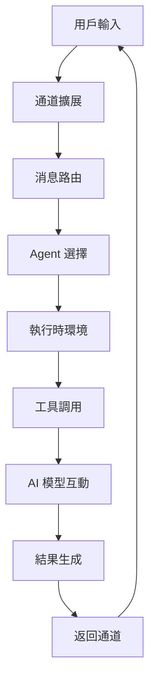

# OpenClaw 簡介與安裝 (Introduction and Installation)

> 最後更新：2026-04-28
> 完整性狀態：技術深度架構說明，新增設計原理與原始碼連結
> 相關原始碼：`src/index.ts`、`src/entry.ts`、`src/runtime.ts`、`src/gateway/`、`src/cli/program/`

## 什麼是 OpenClaw？

OpenClaw 是一個開源的個人 AI 數位助理框架，設計用於在各種通訊平台（如 WhatsApp、Telegram、Discord 等）上提供智能自動化服務。它允許用戶透過自然語言與 AI 模型互動，執行任務如訊息自動回覆、檔案操作、網頁抓取、工作流程自動化等。OpenClaw 強調本地運行和資料隱私，支持連接多種開源和商業 AI 模型（如 Claude、DeepSeek、GPT 等），同時提供豐富的技能（Skill）擴展機制，讓開發者可以自行添加功能。

### 核心設計理念

OpenClaw 的架構設計基於以下幾個核心原則：

1. **本地優先**：盡可能在本地執行，減少對雲端依賴，確保資料隱私與離線可用性
2. **模組化擴展**：透過插件和技能系統實現功能擴展，保持核心框架的輕量化
3. **安全隔離**：多層安全機制，包括插件審計、沙箱執行、權限控制等
4. **統一介面**：為不同通訊平台提供統一的 Agent 互動介面，簡化開發複雜度

## 架構與實作原理

### 核心模組架構

OpenClaw 的架構採用分層設計，每個層次都有明確的職責：

| 模組 | 檔案 | 作用 |
|------|------|------|
| 入口層 | `src/index.ts`、`src/entry.ts` | 程式入口、CLI 啟動、配置加載 |
| 執行時層 | `src/runtime.ts` | 執行時環境管理、Agent 生命週期、事件系統 |
| Gateway 層 | `src/gateway/` | HTTP/WebSocket 服務、狀態管理、遠程通信 |
| CLI 層 | `src/cli/` | 命令列介面、參數解析、非互動操作 |
| Agent 層 | `src/agents/` | Agent 管理、會話狀態、工具選擇 |
| 技能層 | `src/skills/`、`src/plugins/` | 技能載入、插件管理、功能擴展 |
| 通道層 | `src/channels/`、`src/extensions/` | 通訊平台介面、消息路由、事件處理 |
| 配置層 | `src/config/` | 配置管理、驗證、熱重載 |

### 關鍵型別定義

```typescript
// 主要執行時類型 (src/runtime.ts)
export interface OpenClawRuntime {
  readonly version: string;
  readonly config: OpenClawConfig;
  readonly gateway: GatewayService;
  readonly agents: AgentService;
  readonly skills: SkillRegistry;
  readonly extensions: ExtensionRegistry;
  readonly logger: LoggerService;
}

// Agent 服務接口 (src/agents/agent-service.ts)
export interface AgentService {
  createAgent(opts: AgentCreateOptions): Promise<Agent>;
  listAgents(): Agent[];
  getAgent(id: string): Agent | null;
  runAgent(agentId: string, input: AgentInput): Promise<AgentOutput>;
}

// Gateway 服務接口 (src/gateway/gateway-service.ts)
export interface GatewayService {
  start(): Promise<void>;
  stop(): Promise<void>;
  getStatus(): GatewayStatus;
  listModels(): ModelInfo[];
  handleWebSocket(connection: WebSocket): Promise<void>;
}
```

### 核心流程



### 原始碼入口與啟動流程

| 類型 | 檔案 | 作用 |
|------|------|------|
| 程式入口 | `src/index.ts` | 主程式入口，解析命令列參數 |
| 啟動邏輯 | `src/entry.ts` | 初始化配置、創建執行時環境 |
| 執行時核心 | `src/runtime.ts` | 創建並管理各種服務 |
| Gateway 啟動 | `src/gateway/` | 啟動 HTTP/WebSocket 服務 |
| CLI 註冊 | `src/cli/program/` | 註冊各種命令列指令 |
| 配置加載 | `src/config/` | 加載、驗證配置文件 |

## 安裝 / 環境需求

### 系統需求

- **Node.js 版本 ≥ 22**（建議使用 LTS 版本，v22.12.0 或更新）
- **npm 或 pnpm** 作為套件管理器（建議使用 pnpm 以獲得更好的依賴管理）
- 支援的作業系統：macOS、Linux（包括 WSL）、Windows
- **磁碟空間**：至少 500MB 可用空間（用於依賴和緩存）
- **網路連接**：首次安裝時需要網路下載依賴，本地模式可離線運行

### 安全加固建議

為避免安全風險，安裝後建議執行以下安全加固步驟：

```bash
# 1. 修改 Canvas Host 綁定地址
openclaw config set canvasHost.bind "127.0.0.1"

# 2. 設置安全日誌級別
openclaw config set logging.level "info"

# 3. 啟用配置驗證
openclaw config validate

# 4. 檢查安全狀態
openclaw security audit
```

### 安裝步驟（以 macOS 為例）

#### 方法一：從源碼安裝（推薦用於開發）

```bash
# 1. 克隆存儲庫
git clone https://github.com/openclaw/openclaw.git
cd openclaw

# 2. 安裝依賴
pnpm install

# 3. 建置專案
pnpm build

# 4. 首次運行並按照提示進行設定（如選擇通訊平台、設定 API 金鑰等）
pnpm dev
```

#### 方法二：透過 npm 全域安裝（適合生產環境）

```bash
# 安裝 OpenClaw
npm install -g openclaw

# 初始化配置
openclaw setup

# 啟動服務
openclaw gateway start
```

#### 方法三：使用 Docker（推薦用於部署）

```bash
# 拉取 Docker 鏡像
docker pull openclaw/openclaw:latest

# 運行容器
docker run -d \
  --name openclaw \
  -p 19001:19001 \
  -v ~/.openclaw:/root/.openclaw \
  openclaw/openclaw:latest

# 查看日誌
docker logs -f openclaw
```

## 核心概念

### Agent 系統

OpenClaw 的 Agent 系統是整個框架的核心，負責：

- **意圖識別**：理解使用者的自然語言輸入
- **工具選擇**：根據任務需求選擇合適的工具和技能
- **執行協調**：協調多個工具的執行順序
- **結果整合**：整合各個工具的執行結果

### 技能（Skills）系統

Skills 是 OpenClaw 的功能擴展機制，每個技能都是一個獨立的功能包：

```typescript
interface Skill {
  name: string;
  description: string;
  metadata: SkillMetadata;
  execute(context: SkillContext): Promise<SkillResult>;
}
```

### 通道（Channels）系統

通道系統負責與各種通訊平台對接：

- **消息路由**：將平台特定的消息轉換為統一格式
- **事件處理**：處理平台特定的事件（如用戶加入、消息刪除等）
- **狀態同步**：同步不同平台之間的會話狀態

### Gateway 服務

Gateway 是 OpenClaw 的核心服務，提供：

- **HTTP API**：供外部應用調用
- **WebSocket**：實時通信
- **狀態管理**：管理 Agent 和會話狀態
- **安全控制**：認證、授權、審計

## CLI 指令說明

OpenClaw 提供豐富的命令列介面進行設定、調試和執行特定操作。以下是一些常用指令：

### 基礎指令

```bash
# 查看所有可用指令
openclaw --help

# 查看版本信息
openclaw version

# 查看系統狀態
openclaw status

# 安全審計
openclaw security audit
```

### 配置管理

```bash
# 互動式設定精靈
openclaw configure

# 非互動配置讀寫
openclaw config get <path>
openclaw config set <path> <value>
openclaw config validate

# 查看配置文件位置
openclaw config file
```

### 服務管理

```bash
# 啟動 Gateway 服務
openclaw gateway start

# 停止 Gateway 服務
openclaw gateway stop

# 查看日誌
openclaw logs

# 重啟服務
openclaw restart
```

### Agent 管理

```bash
# 列出所有 Agent
openclaw agents list

# 創建新 Agent
openclaw agent create <name>

# 管理 Agent 會話
openclaw sessions list
openclaw sessions show <key>
```

### 技能管理

```bash
# 列出可用技能
openclaw skills list

# 安裝技能
openclaw skills install <skill-name>

# 更新技能
openclaw skills update --all

# 重新載入技能
openclaw skills reload
```

### 通道管理

```bash
# 設定通道
openclaw setup discord
openclaw setup telegram
openclaw setup whatsapp

# 查看通道狀態
openclaw channels status
```

## 實際應用範例

### 場景一：建立本地開發環境

**背景說明**：開發者希望在本地進行 Agent 開發和測試，不需要完整的 Gateway 服務。

**完整步驟**：

```bash
# 1. 克隆 OpenClaw 專案
git clone https://github.com/openclaw/openclaw.git
cd openclaw

# 2. 安裝依賴
pnpm install

# 3. 建置專案
pnpm build

# 4. 啟動本地 TUI（無需 Gateway）
openclaw chat

# 5. 在 TUI 中進行開發測試
!ls -la
!cat package.json
!echo "test" > test.txt
```

**預期結果**：可以在本地終端中直接測試 Agent 功能，所有本地工具正常工作。

### 場景二：建立生產環境部署

**背景說明**：需要在生產環境中部署 OpenClaw 服務，支援多個通訊平台。

**完整步驟**：

```bash
# 1. 使用 Docker 部署
docker run -d \
  --name openclaw-prod \
  -p 19001:19001 \
  -p 19002:19002 \
  -v /opt/openclaw/config:/root/.openclaw \
  -v /opt/openclaw/logs:/root/.openclaw/logs \
  openclaw/openclaw:latest

# 2. 設定自動重啟
docker update --restart unless-stopped openclaw-prod

# 3. 配置監控
cat > /etc/systemd/system/openclaw.service << EOF
[Unit]
Description=OpenClaw Service
After=docker.service

[Service]
Type=oneshot
RemainAfterExit=yes
ExecStart=/usr/bin/docker start openclaw-prod
ExecStop=/usr/bin/docker stop openclaw-prod

[Install]
WantedBy=multi-user.target
EOF

# 4. 啟動服務
systemctl enable openclaw
systemctl start openclaw
```

**預期結果**：OpenClaw 服務在生產環境中穩定運行，支援多個通訊平台，並有完善的監控和重啟機制。

### 場景三：安全加固配置

**背景說明**：需要對 OpenClaw 進行安全加固，確保部署的安全性。

**完整步驟**：

```bash
# 1. 修改 Gateway 綁定地址
openclaw config set gateway.bind "127.0.0.1"

# 2. 設置認證模式
openclaw config set gateway.auth.mode "token"

# 3. 設置工具白名單
openclaw config set tools.allow '["file:read", "file:write", "http:fetch"]'

# 4. 設置通道安全策略
openclaw config set channels.discord.dmPolicy "pairing"
openclaw config set channels.telegram.groups."*".requireMention true

# 5. 啟用審計日誌
openclaw config set logging.audit.enabled true

# 6. 驗證配置
openclaw config validate
```

**預期結果**：OpenClaw 服務具有基本的安全防護措施，包括網路隔離、認證控制、工具權限管理等。

## 應用主題分類

| 主題 | 適用場景 | 複雜度 | 技術要求 |
|------|---------|-------|---------|
| 股票分析 | 自動抓取股票資訊、生成投資報告 | ⭐⭐⭐ | API 整合、數據分析 |
| 自動寫 code | 根據描述生成程式碼片段、重構現有程式 | ⭐⭐ | 程式碼分析、模板生成 |
| 文件分析 | 摘要長文檔案、提取關鍵資訊、翻譯文件 | ⭐⭐ | 自然語言處理 |
| 系統管理 | 自動化系統維護、日誌分析、性能監控 | ⭐⭐⭐ | 系統 API、腳本編寫 |
| 客服自動化 | 自動回覆客戶詢問、工單處理 | ⭐⭐ | 自然語言處理、工作流 |
| 數據收集 | 自動抓取網站資訊、監控數據變化 | ⭐⭐ | 爬蟲技術、數據處理 |

## 常見問題與排錯

### 安裝問題

| 問題 | 可能原因 | 解法 |
|------|----------|------|
| 安裝後無法啟動 | Node.js 版本過舊 | 升級 Node.js 至 v22 或以上 |
| pnpm 安裝失敗 | npm 版本過舊 | 升級 npm: `npm install -g npm@latest` |
| 依賴下載失敗 | 網路問題 | 使用代理或換源：`pnpm config set registry https://registry.npmmirror.com` |

### 配置問題

| 問題 | 可能原因 | 解法 |
|------|----------|------|
| Gateway 啟不來 | 配置文件錯誤 | `openclaw config validate` 檢查配置 |
| 通道連接失敗 | API 金鑰錯誤 | 重新執行 `openclaw setup <platform>` |
| Agent 執行失敗 | 工具權限問題 | 檢查 `tools.allow` 和 `tools.deny` 配置 |

### 性能問題

| 問題 | 可能原因 | 解法 |
|------|----------|------|
| 回應延遲過高 | AI 模型回應時間長 | 使用本地模型或調整超時設定 |
| 記憶體使用過高 | 會話狀態未清理 | 定期清理舊會話：`openclaw sessions cleanup` |
| Gateway 負載過高 | 並發請求過多 | 調整 `gateway.maxConcurrent` 設定 |

## 參考資源

### 官方資源

- [官方文檔](https://docs.openclaw.ai) — 最新官方說明和 API 文檔
- [GitHub 倉庫](https://github.com/openclaw/openclaw) — 原始碼、Issue 和 Pull Request
- [CHANGELOG.md](https://github.com/openclaw/openclaw/blob/main/CHANGELOG.md) — 版本更新記錄
- [CONTRIBUTING.md](https://github.com/openclaw/openclaw/blob/main/CONTRIBUTING.md) — 貢獻指南

### 社群資源

- [Discord 社群](https://discord.gg/clawd) — 即時技術支持和討論
- [ClawHub 技能註冊表](https://clawhub.com) — 可用的技能和插件
- [Stack Overflow](https://stackoverflow.com/questions/tagged/openclaw) — 技術問題解答

### 開發資源

- [OpenClaw 開發指南](https://github.com/openclaw/openclaw/blob/main/docs/DEVELOPING.md) — 開發環境設置
- [API 文檔](https://docs.openclaw.ai/api) — REST API 和 WebSocket 文檔
- [插件開發文檔](https://docs.openclaw.ai/plugins) — 插件開發指南

---
*此文件由 AI agent 自動生成並持續更新*

## 更新記錄

- 2026-04-28：大幅重寫整份文件，新增技術架構說明、設計原理、原始碼連結；新增安全加固指南、生產環境部署範例、詳細的 CLI 指令說明；新增三個實際應用場景和完整的排錯指南