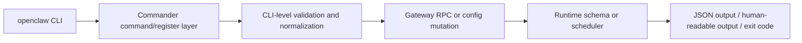

# OpenClaw CLI 深度參考 (CLI Deep Reference)

> 最後更新：2026-04-24
> 完整性狀態：已完整盤點根命令分類，以及 `config` / `cron` 兩條高價值命令線；其餘子命令先列分類與入口，待後續逐條補完
> 相關原始碼：`src/cli/program/core-command-descriptors.ts`、`src/cli/program/register.subclis-core.ts`、`src/cli/config-cli.ts`、`src/cli/cron-cli/register.ts`、`src/cli/cron-cli/register.cron-add.ts`、`src/cli/cron-cli/register.cron-edit.ts`、`src/cli/cron-cli/register.cron-simple.ts`

## 概覽與設計動機

OpenClaw CLI 不是單純把 HTTP API 包一層殼，而是整個本地操作面、設定入口、診斷工具與背景自動化的統一控制層。從原始碼看，CLI 的設計重點有三個：第一，將「互動式流程」與「可腳本化操作」拆成不同入口，像 `configure` 偏向 wizard，`config` 則是可批次、自動化、可驗證的非互動命令；第二，把高風險或高複雜度操作的驗證前移到 CLI 層，例如 `cron add` 會在送進 Gateway 前就檢查 payload 互斥、session target 合法性、delivery 條件與 timezone 邊界；第三，用第一方 docs 與 schema 幫助人與工具共用同一套契約，而不是讓文件、Control UI、CLI 各寫各的。

對資深工程師來說，真正要讀懂的不是「有哪些命令」，而是：命令從哪個 register 檔註冊、哪些 option 是 commander 定義、哪些限制是在 CLI 做、哪些邏輯下沉到 Gateway/Config schema、哪些行為其實是從測試才看得出來。這也是本文件的寫法基準：先把命令樹與入口建立起來，再用 `openclaw config` 與 `openclaw cron` 當完整樣本，示範如何把 option、預設值、互斥規則、批次模式、錯誤輸出與測試邊界，轉成能實際工作的學習資料。

## 架構與實作原理

### 核心模組

| 模組 | 檔案 | 作用 |
|------|------|------|
| 根命令分類 | `src/cli/program/core-command-descriptors.ts` | 定義核心命令名稱、描述與是否有子命令 |
| 子命令註冊 | `src/cli/program/register.subclis-core.ts` | 將 `cron`、`channels`、`sandbox`、`nodes` 等 CLI 模組掛到主程式 |
| Config CLI | `src/cli/config-cli.ts` | 定義 `config get/set/unset/file/schema/validate` 與 builder/dry-run 模式 |
| Cron CLI 入口 | `src/cli/cron-cli/register.ts` | 註冊 `cron` 命令與 docs link |
| Cron add/list/status | `src/cli/cron-cli/register.cron-add.ts` | 實作 `cron add`、`list`、`status` |
| Cron edit | `src/cli/cron-cli/register.cron-edit.ts` | 實作 patch 型編輯與 failure alert / delivery patch |
| Cron simple | `src/cli/cron-cli/register.cron-simple.ts` | 實作 `show`、`runs`、`run`、`rm`、`enable`、`disable` |

### 關鍵型別與控制面

```typescript
export function registerConfigCli(program: Command) {
  const cmd = program
    .command("config")
    .description(
      "Non-interactive config helpers (get/set/unset/file/schema/validate). Run without subcommand for guided setup.",
    );
}
```

來源：`src/cli/config-cli.ts`

```typescript
export function registerCronCli(program: Command) {
  const cron = program
    .command("cron")
    .description("Manage cron jobs (via Gateway)");
}
```

來源：`src/cli/cron-cli/register.ts`

### 核心流程



### 原始碼入口與驗證來源

| 類型 | 檔案 | 作用 |
|------|------|------|
| 根命令入口 | `src/cli/program/core-command-descriptors.ts` | 列出核心命令分類 |
| 子命令註冊 | `src/cli/program/register.subclis-core.ts` | 載入各 CLI surface |
| Config 入口 | `src/cli/config-cli.ts` | 定義 config 子命令與 set 模式 |
| Cron 入口 | `src/cli/cron-cli/register.ts` | 組合 cron 子命令 |
| Cron add 驗證 | `src/cli/cron-cli/register.cron-add.ts` | 互斥條件、預設 session、delivery 規則 |
| Cron edit 驗證 | `src/cli/cron-cli/register.cron-edit.ts` | patch 行為、enable/disable、payload 互斥 |
| Config 第一方 docs | `docs/cli/config.md` | 官方解釋 config path、set modes、dry-run |
| Cron 第一方 docs | `docs/cli/cron.md` | 官方說明 cron 語意、delivery、retention |
| Config 測試 | `src/cli/config-cli.test.ts` | `validate` 成功/失敗與 `--json` 行為 |
| Cron 測試 | `src/cli/cron-cli.test.ts` | DST、`--tz`、delivery default、account 等邊界 |

## CLI 指令完整參考

### 命令樹

```text
openclaw
  ├─ setup
  ├─ onboard
  ├─ configure
  ├─ config
  ├─ backup
  ├─ doctor
  ├─ dashboard
  ├─ reset
  ├─ uninstall
  ├─ message
  ├─ mcp
  ├─ agent
  ├─ agents
  ├─ status
  ├─ health
  ├─ sessions
  ├─ tasks
  ├─ cron
  ├─ channels
  ├─ secrets
  ├─ skills
  ├─ gateway
  ├─ models
  ├─ sandbox
  ├─ nodes
  ├─ devices
  ├─ hooks
  └─ ...其他模組化子命令
```

### 根命令總覽

| 指令 | 是否有子命令 | 原始碼入口 | 說明 |
|------|--------------|------------|------|
| `setup` | 否 | `src/cli/program/core-command-descriptors.ts` | 初始化本地 config 與 agent workspace |
| `onboard` | 否 | `src/cli/program/core-command-descriptors.ts` | 互動式 onboarding |
| `configure` | 否 | `src/cli/program/core-command-descriptors.ts` | 互動式設定精靈 |
| `config` | 是 | `src/cli/config-cli.ts` | 非互動設定讀寫與驗證 |
| `message` | 是 | `src/cli/program/core-command-descriptors.ts` | 訊息發送與管理 |
| `mcp` | 是 | `src/cli/program/core-command-descriptors.ts` | MCP 設定與橋接 |
| `agent` | 否 | `src/cli/program/core-command-descriptors.ts` | 執行單次 agent turn |
| `agents` | 是 | `src/cli/program/core-command-descriptors.ts` | 管理 isolated agents |
| `sessions` | 是 | `src/cli/program/core-command-descriptors.ts` | session 檢視與管理 |
| `cron` | 是 | `src/cli/cron-cli/register.ts` | 排程與背景工作 |

### 樣本一：`openclaw config`

`config` 的設計定位很清楚：它不是 wizard，而是給 shell script、CI、自動化 agent、Control UI 周邊工具使用的非互動操作面。這也是為什麼它同時提供 path addressing、JSON/JSON5 解析、SecretRef builder、provider builder、batch mode、dry-run 與 schema 輸出。對 agent 來說，這條命令線是最好的樣本，因為它完整展示了 OpenClaw CLI 如何把「文件契約」、「schema 驗證」與「安全寫入」綁在一起。

#### 子命令總覽

| 指令 | Alias | 原始碼入口 | 說明 |
|------|-------|------------|------|
| `openclaw config` | 無 | `src/cli/config-cli.ts` | 無子命令時進 guided setup |
| `openclaw config get <path>` | 無 | `src/cli/config-cli.ts` | 讀取 dot/bracket path |
| `openclaw config set [path] [value]` | 無 | `src/cli/config-cli.ts` | 寫入值、SecretRef、provider 或 batch payload |
| `openclaw config unset <path>` | 無 | `src/cli/config-cli.ts` | 刪除設定節點 |
| `openclaw config file` | 無 | `src/cli/config-cli.ts` | 顯示 active config file path |
| `openclaw config schema` | 無 | `src/cli/config-cli.ts` | 輸出 live JSON Schema |
| `openclaw config validate` | 無 | `src/cli/config-cli.ts` | 驗證目前 config，不啟動 Gateway |

#### Root option

| 參數 | 型別 | 必填 | 預設值 | 說明 |
|------|------|------|--------|------|
| `--section <section>` | repeatable string | 否 | `[]` | 只在沒有子命令時生效，限制 guided setup 的 section 範圍 |

#### `config set` 參數矩陣

| 參數 | 型別 | 必填 | 預設值 | 說明 |
|------|------|------|--------|------|
| `[path]` | string | 視模式而定 | — | dot 或 bracket notation 路徑 |
| `[value]` | string | 視模式而定 | — | JSON/JSON5 或 raw string |
| `--strict-json` | boolean | 否 | `false` | 強制 JSON/JSON5 解析，解析失敗就報錯 |
| `--json` | boolean | 否 | `false` | `--strict-json` 的 legacy alias |
| `--dry-run` | boolean | 否 | `false` | 驗證變更但不寫入 `openclaw.json` |
| `--allow-exec` | boolean | 否 | `false` | dry-run 時允許 exec SecretRef 做 resolvability 檢查 |
| `--merge` | boolean | 否 | `false` | 合併 object/map，而非直接覆蓋 |
| `--replace` | boolean | 否 | `false` | 允許完整替換受保護的 map/list 路徑 |
| `--ref-provider <alias>` | string | 否 | — | SecretRef builder provider alias |
| `--ref-source <source>` | string | 否 | — | SecretRef source：`env|file|exec` |
| `--ref-id <id>` | string | 否 | — | SecretRef id |
| `--provider-source <source>` | string | 否 | — | provider builder source |
| `--provider-path <path>` | string | 否 | — | file provider 路徑 |
| `--provider-mode <mode>` | string | 否 | — | file provider：`singleValue|json` |
| `--provider-command <path>` | string | 否 | — | exec provider 絕對路徑 |
| `--provider-arg <arg>` | repeatable string | 否 | `[]` | exec provider 參數 |
| `--provider-env <key=value>` | repeatable string | 否 | `[]` | exec provider 額外 env |
| `--provider-pass-env <envVar>` | repeatable string | 否 | `[]` | pass-through host env |
| `--provider-trusted-dir <path>` | repeatable string | 否 | `[]` | exec provider trusted dir |
| `--provider-allow-insecure-path` | boolean | 否 | `false` | 略過嚴格 path 權限檢查 |
| `--provider-allow-symlink-command` | boolean | 否 | `false` | 允許 symlink command path |
| `--batch-json <json>` | string | 否 | — | 以 JSON array 一次套多筆 set operation |
| `--batch-file <path>` | string | 否 | — | 從檔案讀 batch payload |

#### `config validate` 參數矩陣

| 參數 | 型別 | 必填 | 預設值 | 說明 |
|------|------|------|--------|------|
| `--json` | boolean | 否 | `false` | 改用 machine-readable JSON 輸出驗證結果 |

#### 參數限制與互動規則

| 規則 | 說明 | 來源 |
|------|------|------|
| Guided mode 限制 | `--section` 只在 `openclaw config` 無子命令時有意義 | `src/cli/config-cli.ts` |
| JSON 解析策略 | `value` 先嘗試 JSON5，失敗才退回 raw string；`--strict-json` 會禁止 fallback | `src/cli/config-cli.ts`、`docs/cli/config.md` |
| 受保護路徑 | `agents.defaults.models` 等 map/list 預設拒絕整體覆蓋，需 `--replace` | `docs/cli/config.md` |
| 安全驗證 | `--dry-run` 不會寫檔；exec SecretRef 檢查預設跳過，需 `--allow-exec` | `src/cli/config-cli.ts`、`docs/cli/config.md` |
| `validate --json` 行為 | invalid 時輸出 `{ valid:false, issues:[...] }`，保留 allowed values metadata | `src/cli/config-cli.test.ts` |
| 缺檔處理 | config file 不存在時 `validate` 會 exit 1 並回報 file not found | `src/cli/config-cli.test.ts` |

#### 實際指令範例

基本讀取與寫入：

```bash
openclaw config get agents.defaults.workspace
openclaw config set gateway.port 19001 --strict-json
openclaw config unset plugins.entries.brave.config.webSearch.apiKey
```

SecretRef builder：

```bash
openclaw config set channels.discord.token \
  --ref-provider default \
  --ref-source env \
  --ref-id DISCORD_BOT_TOKEN
```

Provider builder：

```bash
openclaw config set secrets.providers.vault \
  --provider-source exec \
  --provider-command /usr/local/bin/openclaw-vault \
  --provider-arg read \
  --provider-arg openai/api-key \
  --provider-json-only \
  --provider-pass-env VAULT_TOKEN \
  --provider-trusted-dir /usr/local/bin \
  --provider-timeout-ms 5000
```

批次驗證：

```bash
openclaw config set --batch-file ./config-set.batch.json --dry-run
openclaw config validate --json
```

### 樣本二：`openclaw cron`

`cron` 是 OpenClaw CLI 裡最適合用來學「行為型命令面」的案例。原因是它同時包含 schedule parsing、payload kind 選擇、session routing、fallback delivery、account routing、timezone/DST 處理與 retention 設計。從 `register.cron-add.ts` 可以看到，CLI 層本身就做了大量前置驗證，這不是單純把輸入轉送給 Gateway 而已。

#### 子命令總覽

| 指令 | Alias | 原始碼入口 | 說明 |
|------|-------|------------|------|
| `openclaw cron status` | 無 | `src/cli/cron-cli/register.cron-add.ts` | 顯示 scheduler 狀態 |
| `openclaw cron list` | 無 | `src/cli/cron-cli/register.cron-add.ts` | 列出 jobs |
| `openclaw cron add` | `create` | `src/cli/cron-cli/register.cron-add.ts` | 建立 job |
| `openclaw cron edit <id>` | 無 | `src/cli/cron-cli/register.cron-edit.ts` | patch job 欄位 |
| `openclaw cron rm <id>` | `remove`, `delete` | `src/cli/cron-cli/register.cron-simple.ts` | 刪除 job |
| `openclaw cron enable <id>` | 無 | `src/cli/cron-cli/register.cron-simple.ts` | 啟用 job |
| `openclaw cron disable <id>` | 無 | `src/cli/cron-cli/register.cron-simple.ts` | 停用 job |
| `openclaw cron show <id>` | 無 | `src/cli/cron-cli/register.cron-simple.ts` | 顯示 job 詳情 |
| `openclaw cron runs --id <id>` | 無 | `src/cli/cron-cli/register.cron-simple.ts` | 查看 JSONL-backed run history |
| `openclaw cron run <id>` | 無 | `src/cli/cron-cli/register.cron-simple.ts` | 立即執行或僅在 due 時執行 |

#### `cron add` 參數矩陣

| 參數 | 型別 | 必填 | 預設值 | 說明 |
|------|------|------|--------|------|
| `--name <name>` | string | 是 | — | job 名稱 |
| `--description <text>` | string | 否 | — | 可選描述 |
| `--disabled` | boolean | 否 | `false` | 建立時停用 |
| `--delete-after-run` | boolean | 否 | `false` | one-shot 成功後刪除 |
| `--keep-after-run` | boolean | 否 | `false` | one-shot 成功後保留 |
| `--agent <id>` | string | 否 | — | 指定 agent |
| `--session <target>` | string | 否 | payload 決定 | `main`、`isolated`、`current`、`session:<id>` |
| `--session-key <key>` | string | 否 | — | 額外 routing key |
| `--wake <mode>` | string | 否 | `now` | `now` 或 `next-heartbeat` |
| `--at <when>` | string | 否 | — | 一次性執行時間 |
| `--every <duration>` | string | 否 | — | 間隔執行 |
| `--cron <expr>` | string | 否 | — | cron expression |
| `--tz <iana>` | string | 否 | `""` | timezone |
| `--stagger <duration>` | string | 否 | — | cron stagger 視窗 |
| `--exact` | boolean | 否 | `false` | 關閉 stagger，等同設成 0 |
| `--system-event <text>` | string | 否 | — | main session payload |
| `--message <text>` | string | 否 | — | agentTurn payload |
| `--thinking <level>` | string | 否 | — | `off|minimal|low|medium|high|xhigh` |
| `--model <model>` | string | 否 | — | model override |
| `--timeout-seconds <n>` | number | 否 | — | agent job timeout |
| `--light-context` | boolean | 否 | `false` | 啟用輕量 bootstrap context |
| `--tools <list>` | string/list | 否 | — | tool allow-list |
| `--announce` | boolean | 否 | 視 session 推導 | fallback deliver 最終文字到 chat |
| `--deliver` | boolean | 否 | deprecated | `--announce` 舊別名 |
| `--no-deliver` | boolean | 否 | 視 session 推導 | 關閉 runner fallback delivery |
| `--channel <channel>` | string | 否 | `last` | delivery channel |
| `--to <dest>` | string | 否 | — | delivery destination |
| `--account <id>` | string | 否 | — | multi-account delivery account |
| `--best-effort-deliver` | boolean | 否 | `false` | delivery 失敗不視為 job 失敗 |
| `--json` | boolean | 否 | `false` | 輸出 JSON |

#### `cron run` / `runs` 核心參數

| 指令 | 參數 | 說明 |
|------|------|------|
| `cron runs` | `--id <id>` | 必填 job id |
| `cron runs` | `--limit <n>` | 預設 `50` |
| `cron run` | `<id>` | job id |
| `cron run` | `--due` | 保留舊行為，只在 due 時執行 |

#### 參數限制與互動規則

| 規則 | 說明 | 來源 |
|------|------|------|
| payload 互斥 | 必須二選一：`--system-event` 或 `--message` | `src/cli/cron-cli/register.cron-add.ts` |
| delivery flag 互斥 | `--announce` 與 `--no-deliver` 不可同時指定 | `src/cli/cron-cli/register.cron-add.ts` |
| one-shot 保留/刪除互斥 | `--delete-after-run` 與 `--keep-after-run` 不可同時用 | `src/cli/cron-cli/register.cron-add.ts` |
| session 合法值 | `main`、`isolated`、`current`、`session:<id>` | `src/cli/cron-cli/register.cron-add.ts` |
| main session 限制 | `main` 只能搭配 `--system-event` | `src/cli/cron-cli/register.cron-add.ts` |
| isolated/current/custom 限制 | 非 main agent job 必須用 `--message` | `src/cli/cron-cli/register.cron-add.ts` |
| account 限制 | `--account` 只允許 non-main agentTurn delivery job | `src/cli/cron-cli/register.cron-add.ts` |
| 預設 session 推導 | 未指定 `--session` 時，`systemEvent -> main`，`message -> isolated` | `src/cli/cron-cli.test.ts` |
| 預設 delivery | isolated `cron add` 預設為 `announce` | `src/cli/cron-cli.test.ts`、`docs/cli/cron.md` |
| `--tz` 邊界 | `--every` 不可搭配 `--tz`；offset-less `--at` 才會套用 timezone | `src/cli/cron-cli.test.ts` |
| DST gap 驗證 | 不存在的 wall-clock time 會被拒絕 | `src/cli/cron-cli.test.ts` |

#### 實際指令範例

基本 one-shot main session：

```bash
openclaw cron add \
  --name "Reminder" \
  --at "2026-05-01T09:00:00Z" \
  --session main \
  --system-event "Review release checklist"
```

isolated agent job，使用 lightweight context 並停用 fallback delivery：

```bash
openclaw cron add \
  --name "Lightweight morning brief" \
  --cron "0 7 * * *" \
  --session isolated \
  --message "Summarize overnight updates." \
  --light-context \
  --no-deliver
```

指定 timezone 與 account delivery：

```bash
openclaw cron add \
  --name "Daily report" \
  --cron "0 8 * * *" \
  --tz "Asia/Taipei" \
  --session isolated \
  --message "Prepare the daily report." \
  --announce \
  --channel telegram \
  --to "123456789" \
  --account "ops-bot"
```

手動執行與追 run history：

```bash
openclaw cron run <job-id>
openclaw cron runs --id <job-id> --limit 20
```

## 進階使用場景

### 場景一：把 CLI 文件化流程複製到任一子命令

若你要讓 agent 為另一個 CLI 主題寫深度文件，最穩定的流程不是先查網路，而是先抄 `config` / `cron` 的分析方法：

1. 從 `src/cli/program/core-command-descriptors.ts` 或 `register.subclis-core.ts` 找 root command 與 loader。
2. 進入實際 register 檔，列出 `.command()`、`.argument()`、`.option()`、`.requiredOption()`。
3. 再讀對應第一方 docs，例如 `docs/cli/<topic>.md`。
4. 最後讀 `*.test.ts` 補齊預設行為、互斥條件與錯誤訊息。

這種順序的價值在於：文件先從 code truth 出發，再用 docs 補背景，再用 tests 補邊界，不會倒過來被敘述性文件誤導。

### 場景二：在 CI 或自動化流程中安全改寫 config

對自動化 agent 來說，最常見的失敗不是不會寫 JSON，而是「把整個 map 覆蓋掉」。推薦的安全流程：

```bash
openclaw config get agents.defaults.models --json
openclaw config set agents.defaults.models '{"openai-codex/gpt-5.4":{}}' --strict-json --merge --dry-run
openclaw config validate --json
openclaw config set agents.defaults.models '{"openai-codex/gpt-5.4":{}}' --strict-json --merge
```

預期結果：先看目前值，再用 `--merge` 與 `--dry-run` 做預演，最後用 `validate` 驗證整份 config，而不是直接覆蓋。

## 配置與客製化

CLI 本身也有與設定互動的幾個關鍵面：

### 常用設定路徑

| 路徑 | 型別 | 用途 | 來源 |
|------|------|------|------|
| `gateway.port` | number | Gateway 監聽 port | `src/config/schema.help.ts`、`docs/gateway/configuration-reference.md` |
| `agents.defaults.models` | map | 模型 allowlist/catalog | `docs/gateway/configuration.md`、`docs/cli/config.md` |
| `channels.<provider>.*` | object | 通道設定 | `docs/gateway/configuration-reference.md` |
| `cron.failureDestination` | object | 全域 cron failure 通知目的地 | `src/config/types.cron.ts` |

### 優先序與生效方式

- `configure` 走互動式流程，適合人工設定。
- `config` 走非互動式路徑，適合自動化與 agent。
- `config schema` 與 `config validate` 是最穩定的機器接口，適合讓 agent 在寫入前後做契約驗證。
- `cron` 的執行細節同時受 CLI 參數、job stored state 與 `cron.*` 設定影響，因此不能只看單一命令列輸入。

## 已知限制與注意事項

- 本文件目前尚未逐條展開 `message`、`channels`、`skills`、`sandbox`、`nodes` 等所有子命令的 option matrix，因此標記為「根命令 + config/cron 樣本完整」。
- `config` 看似單純，但實際上 builder mode、batch mode、protected path replace policy 都是高風險面；若 agent 沒讀 `docs/cli/config.md` 就直接生成文件，極容易漏掉。
- `cron` 的時區與 DST 行為不能憑直覺寫文件，必須看測試；尤其 `--tz` 與 offset-less `--at` 的互動，錯一個細節就會讓排程在實務上失效。

## 常見問題排錯

| 症狀 | 可能原因 | 診斷指令 | 解法 |
|------|----------|----------|------|
| `config validate` 失敗但看不出允許值 | 只看 human-readable 錯誤輸出 | `openclaw config validate --json` | 讀 JSON payload 裡的 `allowedValues` |
| `cron add` 建立成功但沒送到 chat | isolated job 預設 `announce`，但 route 或 target 沒解析成功 | `openclaw cron show <id>`、`openclaw cron runs --id <id>` | 確認 `--channel`、`--to`、`--account` 與 delivery preview |
| `--tz` 沒生效 | 搭配了 `--every`，或 `--at` 已有 offset | `openclaw cron add ... --json` | 改用 offset-less `--at`，不要把 `--tz` 與 `--every` 混用 |
| config 批次改寫後丟失既有項目 | 對 protected map 做了 replace 而非 merge | `openclaw config get <path> --json` | 對 map/list 優先用 `--merge`，必要時才 `--replace` |
| `cron add` 報 payload 錯誤 | 同時傳了 `--system-event` 與 `--message`，或 session/payload 不匹配 | `openclaw cron add --help` | main job 用 `--system-event`，isolated/current job 用 `--message` |

## 參考資源

- [references/cli-reference-ref.md](references/cli-reference-ref.md) — 本文件使用的原始碼、官方 docs 與測試摘要

---
*此文件由 AI agent 自動生成並持續更新*

## 更新記錄

- 2026-04-24：重寫整份文件；改用實際原始碼入口、第一方 docs 與測試為基準，並把 `config` / `cron` 兩條命令線改寫成可複製的 CLI 深度分析樣本