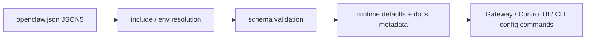

# OpenClaw 設定系統深度指南 (Configuration Deep Guide)

> 最後更新：2026-04-24
> 完整性狀態：已修正實際頂層設定面，並完整說明設定生命週期、schema 契約、`config` CLI 介面與高價值設定區塊；插件/通道私有深層欄位仍應回到各自專屬文件延伸閱讀
> 相關原始碼：`src/config/types.openclaw.ts`、`src/config/types.cron.ts`、`src/config/schema.help.ts`、`src/cli/config-cli.ts`

## 概覽與設計動機

OpenClaw 的設定系統不是單一 JSON 檔，而是一條從「作者手寫 JSON5」到「經過 include/env 解析、schema 驗證、runtime defaults 注入、Control UI 欄位說明生成」的完整契約管線。這也是為什麼設定文件如果只列出幾個常見 key，對實務幫助很有限：真正影響部署穩定性的，是哪些欄位是 schema truth、哪些值會被 runtime 補預設、哪些 surface 可以用 SecretRef、哪些變更會熱重載、哪些錯誤會讓 Gateway 直接拒絕啟動。

從原始碼可看出 OpenClaw 的設定設計有幾個強烈取向。第一，設定面廣但集中，所有核心 root keys 都匯總到 `OpenClawConfig` 型別，避免文件各自發散。第二，文件不是附屬品，`schema.help.ts` 直接維護欄位級描述，讓 CLI、Control UI 與文件共享同一組說明。第三，設定改寫重視安全性與可回復性，`openclaw config set` 內建 dry-run、builder mode、protected path replace policy，而 Gateway 在文件層面也明確採取 strict validation 與 last-known-good restore 策略。這些設計決策的共同目標，是讓設定既能被人類手動維護，也能安全地被 agent 或自動化流程改寫。

## 架構與實作原理

### 核心模組

| 模組 | 檔案 | 作用 |
|------|------|------|
| 設定 root type | `src/config/types.openclaw.ts` | 定義所有頂層設定面與主要子型別 |
| Cron config type | `src/config/types.cron.ts` | 定義 cron retry、retention、failure destination |
| 欄位說明 | `src/config/schema.help.ts` | 為 schema / Control UI / 文件提供欄位描述 |
| Config CLI | `src/cli/config-cli.ts` | 提供非互動讀寫、schema、validate、dry-run |
| 官方概覽 | `docs/gateway/configuration.md` | 說明 JSON5、嚴格驗證、hot reload、常見設定任務 |
| 官方 reference | `docs/gateway/configuration-reference.md` | 欄位層級 reference 與子系統延伸入口 |

### 關鍵型別定義

```typescript
export type OpenClawConfig = {
   $schema?: string;
   meta?: { lastTouchedVersion?: string; lastTouchedAt?: string };
   auth?: AuthConfig;
   acp?: AcpConfig;
   env?: { shellEnv?: { enabled?: boolean; timeoutMs?: number }; vars?: Record<string, string> };
   diagnostics?: DiagnosticsConfig;
   logging?: LoggingConfig;
   cli?: CliConfig;
   update?: { channel?: "stable" | "beta" | "dev"; auto?: { enabled?: boolean } };
   browser?: BrowserConfig;
   ui?: { seamColor?: string };
   secrets?: SecretsConfig;
   skills?: SkillsConfig;
   plugins?: PluginsConfig;
   models?: ModelsConfig;
   agents?: AgentsConfig;
   tools?: ToolsConfig;
   channels?: ChannelsConfig;
   cron?: CronConfig;
   gateway?: GatewayConfig;
   memory?: MemoryConfig;
   mcp?: McpConfig;
};
```

來源：`src/config/types.openclaw.ts`

```typescript
export type CronConfig = {
   enabled?: boolean;
   store?: string;
   maxConcurrentRuns?: number;
   retry?: CronRetryConfig;
   sessionRetention?: string | false;
   runLog?: { maxBytes?: number | string; keepLines?: number };
   failureAlert?: CronFailureAlertConfig;
   failureDestination?: CronFailureDestinationConfig;
};
```

來源：`src/config/types.cron.ts`

### 核心流程



### 原始碼入口與驗證來源

| 類型 | 檔案 | 作用 |
|------|------|------|
| Root config type | `src/config/types.openclaw.ts` | 真實頂層 keys 與子型別來源 |
| 欄位語意 | `src/config/schema.help.ts` | 欄位標題、描述、部分預設行為說明 |
| CLI 操作面 | `src/cli/config-cli.ts` | `get/set/unset/file/schema/validate` |
| CLI 測試 | `src/cli/config-cli.test.ts` | `validate` 成功/失敗、`--json` payload、缺檔處理 |
| 第一方概覽 | `docs/gateway/configuration.md` | hot reload、strict validation、last-known-good restore |
| 第一方 reference | `docs/gateway/configuration-reference.md` | field-level reference 與 subsystem links |

## 配置檔完整參考

### 配置檔位置與格式

- 預設檔案：`~/.openclaw/openclaw.json`
- 格式：JSON5，可使用註解與 trailing commas
- 若檔案不存在，OpenClaw 使用 safe defaults
- 可用 `OPENCLAW_CONFIG_PATH` 指向其他實體檔案
- 第一方文件明確指出：`openclaw.json` 應是 regular file；symlink layout 對 OpenClaw 自有寫入不是穩定契約

### 設定生命週期

OpenClaw 原始碼把設定狀態拆成幾層，這點很重要：

- source config：作者實際寫在檔案裡的設定，經過 include 與 env substitution，但尚未注入 runtime defaults
- resolved config：適合做 `config set/unset` 的中間態，避免把 runtime defaults 直接回寫到檔案
- runtime config：進程內實際使用的最終形態

這個分層的意義是，OpenClaw 不希望 agent 因為讀到了 runtime defaults，就把一大堆未顯式設定的欄位回寫進 `openclaw.json`，導致設定檔膨脹且難以審查。

### 頂層設定欄位總覽

| 路徑 | 型別 | 預設值 | 必填 | 作用 | 來源 |
|------|------|--------|------|------|------|
| `$schema` | string | 無 | 否 | editor/schema metadata | `src/config/types.openclaw.ts` |
| `meta` | object | runtime 維護 | 否 | 最後寫入版本與時間戳 | `src/config/types.openclaw.ts` |
| `auth` | object | 未明列 | 否 | auth 與 profile 相關設定 | `src/config/types.openclaw.ts` |
| `acp` | object | 未明列 | 否 | ACP runtime 與 dispatch | `src/config/types.openclaw.ts` |
| `env` | object | 未明列 | 否 | shell env import 與顯式 env override | `src/config/types.openclaw.ts` |
| `wizard` | object | runtime 維護 | 否 | setup wizard 狀態資訊 | `src/config/types.openclaw.ts` |
| `diagnostics` | object | 未明列 | 否 | tracing / cache / debug 設定 | `src/config/types.openclaw.ts` |
| `logging` | object | 未明列 | 否 | log level、format、redaction | `src/config/types.openclaw.ts` |
| `cli` | object | 未明列 | 否 | CLI banner 與顯示偏好 | `src/config/types.openclaw.ts` |
| `update` | object | 部分欄位有內建 default | 否 | 更新頻道與自動更新 | `src/config/types.openclaw.ts`、`src/config/schema.help.ts` |
| `browser` | object | 未明列 | 否 | 瀏覽器相關設定 | `src/config/types.openclaw.ts` |
| `ui` | object | 未明列 | 否 | UI 視覺設定 | `src/config/types.openclaw.ts` |
| `secrets` | object | 未明列 | 否 | Secret providers 與 secret refs | `src/config/types.openclaw.ts` |
| `skills` | object | 未明列 | 否 | skills 平台設定 | `src/config/types.openclaw.ts` |
| `plugins` | object | 未明列 | 否 | plugin entry 與 runtime 設定 | `src/config/types.openclaw.ts` |
| `surfaces` | object | 未明列 | 否 | surface-specific silent reply policy | `src/config/types.openclaw.ts` |
| `models` | object | 未明列 | 否 | model provider 與 catalog | `src/config/types.openclaw.ts` |
| `nodeHost` | object | 未明列 | 否 | node host 設定 | `src/config/types.openclaw.ts` |
| `agents` | object | 未明列 | 否 | agent defaults、agent list、skills/context limits | `src/config/types.openclaw.ts` |
| `tools` | object | 未明列 | 否 | tool availability 與 provider 選擇 | `src/config/types.openclaw.ts` |
| `bindings` | array | 未明列 | 否 | agent binding 規則 | `src/config/types.openclaw.ts` |
| `broadcast` | object | 未明列 | 否 | broadcast 設定 | `src/config/types.openclaw.ts` |
| `audio` | object | 未明列 | 否 | audio pipeline 設定 | `src/config/types.openclaw.ts` |
| `media` | object | 未明列 | 否 | 上傳檔名保留與 media TTL | `src/config/types.openclaw.ts` |
| `messages` | object | 未明列 | 否 | message layer 設定 | `src/config/types.openclaw.ts` |
| `commands` | object | 未明列 | 否 | command subsystem 設定 | `src/config/types.openclaw.ts` |
| `approvals` | object | 未明列 | 否 | approvals / exec approvals 設定 | `src/config/types.openclaw.ts` |
| `session` | object | 未明列 | 否 | session 行為設定 | `src/config/types.openclaw.ts` |
| `web` | object | 未明列 | 否 | web stack / search / fetch 行為 | `src/config/types.openclaw.ts` |
| `channels` | object | 未明列 | 否 | WhatsApp/Telegram/Discord 等通道設定 | `src/config/types.openclaw.ts`、`docs/gateway/configuration-reference.md` |
| `cron` | object | 未明列 | 否 | scheduler、retry、retention、failure destination | `src/config/types.openclaw.ts`、`src/config/types.cron.ts` |
| `hooks` | object | 未明列 | 否 | hooks / webhook 行為 | `src/config/types.openclaw.ts` |
| `discovery` | object | 未明列 | 否 | discovery / DNS-SD 相關設定 | `src/config/types.openclaw.ts` |
| `canvasHost` | object | 未明列 | 否 | canvas host surface | `src/config/types.openclaw.ts` |
| `talk` | object | 未明列 | 否 | talk provider 與 speech 行為 | `src/config/types.openclaw.ts`、`src/config/schema.help.ts` |
| `gateway` | object | 未明列 | 否 | port、bind、auth、tools、TLS、remote | `src/config/types.openclaw.ts`、`src/config/schema.help.ts` |
| `memory` | object | 未明列 | 否 | memory system 設定 | `src/config/types.openclaw.ts` |
| `mcp` | object | 未明列 | 否 | MCP config 與 bridge | `src/config/types.openclaw.ts` |

### 高價值欄位與設計重點

#### `env`

| 路徑 | 型別 | 預設值 | 允許值/格式 | 作用 | 來源 |
|------|------|--------|-------------|------|------|
| `env.shellEnv.enabled` | boolean | 未明列 | `true/false` | 是否從 login shell 匯入環境變數 | `src/config/types.openclaw.ts`、`src/config/schema.help.ts` |
| `env.shellEnv.timeoutMs` | number | `15000` | 毫秒 | shell env 解析 timeout | `src/config/types.openclaw.ts` |
| `env.vars` | object | 無 | `Record<string,string>` | 顯式 env override | `src/config/schema.help.ts` |

設計意圖：把「依賴 shell profile」與「明確 env 注入」分開，讓開發機與服務環境都能有可預測行為。

#### `update`

| 路徑 | 型別 | 預設值 | 允許值/格式 | 作用 | 來源 |
|------|------|--------|-------------|------|------|
| `update.channel` | string | 未明列 | `stable|beta|dev` | 更新頻道 | `src/config/types.openclaw.ts`、`src/config/schema.help.ts` |
| `update.checkOnStart` | boolean | `true` | `true/false` | 啟動時檢查更新 | `src/config/schema.help.ts` |
| `update.auto.enabled` | boolean | `false` | `true/false` | 開啟背景 auto-update | `src/config/types.openclaw.ts`、`src/config/schema.help.ts` |

#### `gateway`

| 路徑 | 型別 | 預設值 | 允許值/格式 | 作用 | 來源 |
|------|------|--------|-------------|------|------|
| `gateway.port` | number | 未明列 | TCP port | Gateway listener port | `src/config/schema.help.ts` |
| `gateway.mode` | string | 未明列 | `local|remote` | 本地或遠端 gateway 模式 | `src/config/schema.help.ts` |
| `gateway.bind` | string | 未明列 | `auto|lan|loopback|custom|tailnet` | 綁定介面策略 | `src/config/schema.help.ts` |
| `gateway.auth.mode` | string | 未明列 | `none|token|password|trusted-proxy` | HTTP/WebSocket auth 策略 | `src/config/schema.help.ts` |
| `gateway.tools.allow` | array | 無 | tool id list | coarse-grained allowlist | `src/config/schema.help.ts` |
| `gateway.tools.deny` | array | 無 | tool id list | coarse-grained denylist | `src/config/schema.help.ts` |
| `gateway.tls.enabled` | boolean | 未明列 | `true/false` | 啟用內建 TLS termination | `src/config/schema.help.ts` |

設計意圖：Gateway 是所有 channel / agent / Control UI 的邊界，因此 auth、bind、TLS、trusted proxy 等風險面都集中在這裡，而不是散落到各子模組。

#### `agents`

`agents` 是最容易被寫壞、也最常被低估的設定面。從 schema help 可以看出 OpenClaw 明確區分了 defaults 與 per-agent override，尤其 `skills`、`contextLimits` 與 models allowlist 不是自由混用的。

| 路徑 | 型別 | 作用 | 來源 |
|------|------|------|------|
| `agents.defaults.skills` | array | 所有未顯式覆寫 agent 的 skill allowlist | `src/config/schema.help.ts` |
| `agents.defaults.contextLimits.*` | object | memory/tool-result/AGENTS.md excerpt 預設 budget | `src/config/schema.help.ts` |
| `agents.list[].skills` | array | 顯式 agent 的 skill allowlist，會覆蓋 defaults | `src/config/schema.help.ts` |
| `agents.list[].contextLimits.*` | object | per-agent budget override | `src/config/schema.help.ts` |

#### `channels`

`channels` 不是單一 provider 設定，而是「共享 DM / group access policy + provider-specific transport config」的集合。第一方 reference 明確指出各 channel block 自動啟動，除非 `enabled: false`。

| 路徑 | 型別 | 作用 | 來源 |
|------|------|------|------|
| `channels.defaults.groupPolicy` | string | provider-level group policy fallback | `docs/gateway/configuration-reference.md` |
| `channels.defaults.contextVisibility` | string | quoted/thread/history context visibility | `docs/gateway/configuration-reference.md` |
| `channels.modelByChannel` | object | channel id 到 model 的映射 | `docs/gateway/configuration-reference.md` |
| `channels.whatsapp` / `channels.telegram` / ... | object | provider-specific config | `docs/gateway/configuration-reference.md` |

#### `cron`

`cron` 設定是 CLI `cron` 行為的背景控制面，不應只看 `cron add` 命令就以為全貌都在 CLI 參數上。

| 路徑 | 型別 | 預設值 | 允許值/格式 | 作用 | 來源 |
|------|------|--------|-------------|------|------|
| `cron.enabled` | boolean | 未明列 | `true/false` | 全域開關 | `src/config/types.cron.ts` |
| `cron.maxConcurrentRuns` | number | 未明列 | 正整數 | 同時執行數上限 | `src/config/types.cron.ts` |
| `cron.retry.maxAttempts` | number | `3` | 正整數 | transient error 最大重試次數 | `src/config/types.cron.ts` |
| `cron.retry.backoffMs` | array | `[30000, 60000, 300000]` | 毫秒陣列 | retry backoff 序列 | `src/config/types.cron.ts` |
| `cron.retry.retryOn` | array | 全部 transient types | `rate_limit|overloaded|network|timeout|server_error` | 指定重試錯誤類型 | `src/config/types.cron.ts` |
| `cron.sessionRetention` | string/false | `24h` | duration 或 `false` | 完成後 session pruning | `src/config/types.cron.ts` |
| `cron.runLog.maxBytes` | number/string | `2_000_000` | bytes | run log pruning 大小門檻 | `src/config/types.cron.ts` |
| `cron.runLog.keepLines` | number | `2000` | 正整數 | run log pruning 保留行數 | `src/config/types.cron.ts` |
| `cron.failureDestination` | object | 無 | channel/to/accountId/mode | 全域 failure notification 目的地 | `src/config/types.cron.ts` |

#### `talk`

| 路徑 | 型別 | 作用 | 來源 |
|------|------|------|------|
| `talk.provider` | string | active talk provider id | `src/config/schema.help.ts` |
| `talk.providers.*` | object | provider-owned talk config | `src/config/schema.help.ts` |
| `talk.interruptOnSpeech` | boolean | 使用者說話時中斷 assistant speech | `src/config/schema.help.ts` |
| `talk.silenceTimeoutMs` | number | talk mode finalize pause window | `src/config/schema.help.ts` |

## CLI 指令完整參考

### 設定相關命令

| 指令 | 型別 | 必填 | 預設值 | 說明 |
|------|------|------|--------|------|
| `openclaw configure` | interactive command | 否 | — | 啟動 guided setup |
| `openclaw config get <path>` | read command | 是 | — | 讀取 config path |
| `openclaw config set <path> <value>` | write command | 視模式而定 | — | 寫入值、SecretRef、provider 或 batch payload |
| `openclaw config unset <path>` | write command | 是 | — | 刪除設定 |
| `openclaw config file` | read command | 否 | — | 顯示 active config file path |
| `openclaw config schema` | read command | 否 | — | 輸出 live schema |
| `openclaw config validate` | validate command | 否 | — | 驗證 config，不啟動 Gateway |

### 參數限制與互動規則

| 規則 | 說明 | 來源 |
|------|------|------|
| Config 格式 | 僅接受完整符合 schema 的 config；未知 key 或無效值都會拒絕啟動 | `docs/gateway/configuration.md` |
| `config schema` | 輸出 live JSON Schema，含欄位 `title` / `description` 與 plugin/channel metadata | `docs/gateway/configuration-reference.md`、`src/cli/config-cli.test.ts` |
| `config validate --json` | invalid 時輸出 machine-readable payload，保留 allowed values metadata | `src/cli/config-cli.test.ts` |
| protected path replace | 某些 map/list 不允許直接 replace，需顯式 `--replace` | `docs/cli/config.md` |
| dry-run | 可驗證 builder/json/batch mode，但 exec SecretRef 預設不實際執行 | `src/cli/config-cli.ts`、`docs/cli/config.md` |
| last-known-good restore | 啟動後若 config 後續失效，Gateway 可回復 trusted copy 並保留壞檔 | `docs/gateway/configuration.md` |

## 進階使用場景

### 場景一：用 `config set --merge --dry-run` 安全擴充模型 catalog

背景：`agents.defaults.models` 是高風險路徑，直接 replace 容易把既有 allowlist 清掉。

```bash
openclaw config get agents.defaults.models --json
openclaw config set agents.defaults.models '{"openai-codex/gpt-5.4":{}}' --strict-json --merge --dry-run
openclaw config validate --json
openclaw config set agents.defaults.models '{"openai-codex/gpt-5.4":{}}' --strict-json --merge
```

預期結果：先讀現況，再預演 merge，最後才正式寫入，避免誤刪既有模型定義。

### 場景二：設定 cron failure destination，而不是把失敗通知散落在 job 層

背景：對多個 cron jobs 來說，把失敗通知集中到 global config 比每個 job 單獨 patch 更好維護。

```json5
{
   cron: {
      failureDestination: {
         mode: "announce",
         channel: "telegram",
         to: "123456789",
         accountId: "ops-bot",
      },
   },
}
```

或使用 CLI：

```bash
openclaw config set cron.failureDestination '{"mode":"announce","channel":"telegram","to":"123456789","accountId":"ops-bot"}' --strict-json
openclaw config validate
```

### 場景三：把 shell env 與顯式 env override 拆開管理

```json5
{
   env: {
      shellEnv: {
         enabled: true,
         timeoutMs: 15000,
      },
      vars: {
         OPENCLAW_LOG_LEVEL: "info",
      },
   },
}
```

設計理由：`shellEnv` 適合開發機，`env.vars` 適合需要可審計、可重現的服務環境。

## 配置與客製化

### 繼承、覆寫與優先序

- 檔案格式允許 JSON5，但最終仍要過 schema validation。
- `configure` 與 `config` 都操作同一份 config surface；前者偏人工，後者偏自動化。
- `agents.defaults.*` 會成為未覆蓋 agent 的基線；`agents.list[]` 明確覆寫時通常是 replace，不是 merge。
- `channels.defaults.*` 提供 provider-level fallback；channel block 再做細部覆寫。
- `config schema` / `config.schema.lookup` 是 UI 與自動化工具應優先使用的契約來源，不應反向從舊文件猜測欄位。

### SecretRef / Provider / Env Var 寫法

不建議把敏感值直接明文寫在 `openclaw.json`。對自動化流程，比較穩定的做法是用 `config set` 的 SecretRef / provider builder：

```bash
openclaw config set channels.discord.token \
   --ref-provider default \
   --ref-source env \
   --ref-id DISCORD_BOT_TOKEN
```

```bash
openclaw config set secrets.providers.vault \
   --provider-source file \
   --provider-path /etc/openclaw/secrets.json \
   --provider-mode json
```

### 變更生效方式

- 多數設定變更由 Gateway 監看 config file 後自動套用。
- 但是否「立即影響既有 session / 既有 cron job / 既有 channel 連線」要視子系統而定，不能一概而論。
- 嚴格驗證失敗時，Gateway 不會接受新設定；在某些情況下還會還原 last-known-good config。

## 安全配置與結構化物件處理

### 概覽

OpenClaw v2026.4.23 引入了多項安全修復，主要針對三個風險面：
1. **Bot approval gates**：防止未授權的操作執行
2. **結構化物件渲染**：防止 WhatsApp 群組和群聊中的 prompt 注入
3. **工具權限隔離**：MCP 工具的 owner-only 限制

### Bot Approval Gates 安全配置

#### 全局 Bot approval 策略

| 路徑 | 型別 | 預設值 | 作用 | 來源 |
|------|------|--------|------|------|
| `gateway.approvals.mode` | string | `"prompt"` | approval 模式：`"none"`\|`"prompt"`\|`"auto"` | `src/config/types.gateway.ts` |
| `gateway.approvals.requiredTools` | string[] | — | 必須 approval 的工具列表 | `src/config/schema.help.ts` |
| `gateway.approvals.requiredExec` | string[] | — | 必須 approval 的 exec 類型 | `src/config/schema.help.ts` |
| `gateway.approvals.timeoutMs` | number | `30000` | approval 請求超時時間 | `src/config/schema.help.ts` |

#### QQBot 特定安全配置

```json5
{
  channels: {
    qq: {
      enabled: true,
      botApproval: {
        requireFrameworkAuth: true, // v2026.4.23 新增：要求框架認證
        slashCommandPath: "/bot-approve", // 安全 approval 路徑
        allowUnauthorizedSenders: false, // 拒絕未授權發送者
      },
      // ... 其他 QQBot 配置
    }
  }
}
```

### 結構化物件安全渲染配置

#### WhatsApp 安全處理

```json5
{
  channels: {
    whatsapp: {
      enabled: true,
      security: {
        // v2026.4.23 新增：結構化物件隔離處理
        renderStructuredObjects: true,
        maxAttachmentSize: "10MB",
        allowVCardParsing: false, // 防止惡意 vCard
        sanitizeLocationLabels: true, // 清洗位置標籤
        maxParticipantsPerGroup: 500,
      },
      // ... 其他 WhatsApp 配置
    }
  }
}
```

#### 群組聊天安全配置

```json5
{
  channels: {
    discord: {
      enabled: true,
      security: {
        // v2026.4.23 新增：群組名稱和參與者標籤隔離
        sanitizeGroupNames: true,
        sanitizeParticipantLabels: true,
        maxMessageLength: 2000,
        rateLimit: {
          messages: 5,
          period: "1s"
        }
      }
    },
    telegram: {
      enabled: true,
      security: {
        sanitizeGroupNames: true,
        maxMessageLength: 4096,
        allowInlineQueries: false,
      }
    }
  }
}
```

### MCP 工具安全配置

#### Owner-only 工具限制

```json5
{
  mcp: {
    enabled: true,
    security: {
      // v2026.4.23 新增：只允許 owner 調用特定工具
      ownerOnlyTools: [
        "cron",
        "config",
        "system",
        "exec"
      ],
      // 限制 ACPX OpenClaw tools bridge
      restrictAcpxTools: true,
      // 工具調用超時
      toolTimeoutMs: 30000,
      // 允許的工具列表（空表示全部允許）
      allowedTools: [],
      // 拒絕的工具列表
      blockedTools: ["eval", "exec"]
    }
  }
}
```

#### 工具權限級別配置

| 權限級別 | 說明 | 允許的工具 | 來源 |
|----------|------|------------|------|
| `owner` | 完全權限 | 所有工具 | `src/config/types.mcp.ts` |
| `trusted` | 受信任權限 | 基本工具 + 配置工具 | `src/config/types.mcp.ts` |
| `restricted` | 限制權限 | 僅讀取工具 | `src/config/types.mcp.ts` |
| `none` | 無權限 | 無 | `src/config/types.mcp.ts` |

### 全域安全策略

```json5
{
  // 全域安全設定
  security: {
    // 內容安全
    contentSanitization: {
      enabled: true,
      removeHtml: true,
      removeScriptTags: true,
      maxInputLength: 10000,
    },
    
    // 執行安全
    executionSafety: {
      requireApprovalFor: [
        "exec",
        "system",
        "file-write"
      ],
      maxConcurrentExecutions: 3,
      executionTimeoutMs: 30000,
    },
    
    // 網路安全
    networkSecurity: {
      allowedDomains: ["*.openclaw.ai", "localhost"],
      blockSSRF: true,
      maxRedirects: 3,
    },
    
    // 記憶體安全
    memorySafety: {
      maxSessionHistory: 1000,
      maxRunBuffer: 1000000, // 1MB
      autoCleanup: true,
    }
  }
}
```

### 安全配置驗證

```bash
# 驗證安全配置
openclaw config validate --security

# 檢查安全設定
openclaw config get security.contentSanitization
openclaw config get security.executionSafety
openclaw config get security.networkSecurity

# 測試 approval 機制
openclaw config set gateway.approvals.mode "prompt"
openclaw config validate
```

### 安全配置最佳實踐

1. **生產環境建議**：
   - 啟用所有安全功能
   - 使用 `prompt` 模式進行 approval
   - 限制工具權限
   - 定期審計配置

2. **開發環境建議**：
   - 可以使用 `none` 模式加速開發
   - 但仍建議保留基本安全檢查
   - 使用 `auto` 模式進行自動化測試

3. **監控與日誌**：
   - 啟用詳細的安全日誌
   - 監控 approval 請求
   - 記錄所有安全事件

## 已知限制與注意事項

- `OpenClawConfig` 的頂層面很多，但深層欄位中仍有 plugin-owned、channel-owned 與 subsystem-owned surfaces；要做到真正「每一個設定都懂」，必須繼續拆子主題文件，而不是試圖用一篇 04 檔案塞完。
- `schema.help.ts` 提供了大量語意與部分預設值，但不是每個欄位的唯一真相；某些預設仍需回看型別、schema 或 runtime implementation。
- 現有學習資料先前最大問題不是寫太少，而是寫錯設定面；之後任何擴寫都必須以 `types.openclaw.ts` 為頂層 truth。

## 常見問題排錯

| 症狀 | 可能原因 | 診斷指令 | 解法 |
|------|----------|----------|------|
| Gateway 啟不來 | config 不符合 schema 或有未知 key | `openclaw config validate --json`、`openclaw doctor` | 先依 issues 修正，再重啟或讓 Gateway 熱重載 |
| 手改 config 後部分值不見 | 把 runtime defaults 或 replace 結果誤寫回 source config | `openclaw config get <path> --json` | 透過 `config set` 操作 resolved/source surface，避免手動大面積覆蓋 |
| 模型 allowlist 被清掉 | 對 protected map 做直接 replace | `openclaw config get agents.defaults.models --json` | 用 `--merge`，只有刻意重建時才用 `--replace` |
| cron 任務失敗沒有通知 | 只設 job 層 delivery，沒有 failure destination | `openclaw config get cron.failureDestination --json` | 設定 `cron.failureDestination` 或 per-job failure destination |
| talk 行為不符合預期 | provider 與 silence/interrupt 相關參數未對齊 | `openclaw config get talk --json` | 檢查 `talk.provider`、`talk.interruptOnSpeech`、`talk.silenceTimeoutMs` |

## 參考資源

- [references/configuration-ref.md](references/configuration-ref.md) — 本文件使用的原始碼、第一方設定 docs 與測試摘要

---
*此文件由 AI agent 自動生成並持續更新*

## 更新記錄

- 2026-04-29：新增「安全配置與結構化物件處理」章節，涵蓋 v2026.4.23 的安全修復，包括 Bot approval gates、結構化物件安全渲染、MCP 工具權限隔離與全域安全策略配置
- 2026-04-24：重寫整份文件；修正錯誤的頂層設定鍵，改以 `OpenClawConfig`、`schema.help.ts`、官方 configuration docs 與 config CLI 為基礎重建內容