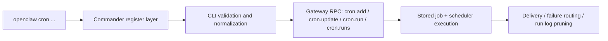

# 定時任務與排程深度指南 (Cron Scheduling Deep Guide)

> 最後更新：2026-04-24
> 完整性狀態：已完整盤點 `openclaw cron` 的 CLI surface、`cron` 設定面、第一方 docs 與已讀取測試覆蓋邊界；scheduler 持久化內部實作仍待後續追到更下層模組
> 相關原始碼：`src/cli/cron-cli/register.ts`、`src/cli/cron-cli/register.cron-add.ts`、`src/cli/cron-cli/register.cron-edit.ts`、`src/cli/cron-cli/register.cron-simple.ts`、`src/config/types.cron.ts`

## 概覽與設計動機

OpenClaw 的 cron 不是一個單純的「背景 shell script 排程器」，而是 Gateway 管理的 durable job surface。從 CLI 與第一方 docs 來看，它的設計目標很明確：把排程、session routing、agent payload、delivery、failure notification 與 retention 放在同一條作業鏈上，讓同一份 job 定義可以同時被人手動操作、被 agent 產生、也能被 Gateway 持久化與回放。這種設計比傳統 cron 多了兩層價值。第一，job 執行不只是一條指令，而是可以是 main session 的 system event，也可以是 isolated/current/custom session 的 agent turn。第二，排程系統本身知道 delivery 與 failure routing，因此不需要把所有通知責任都塞進 payload 內容。

對資深工程師而言，重點不是背下 `cron add` 會有哪些旗標，而是理解幾個核心裁決點：排程類型如何在 CLI 層被解析；`--system-event` 與 `--message` 為何必須互斥；`--session` 為何有推導邏輯；`--announce`、`--no-deliver`、`--account` 為何不是任何 job 都能用；以及 timezone / DST 為什麼必須靠測試驗證而不能憑直覺。這些設計決策直接決定了 job 的可預測性，也決定了文件能不能真的讓使用者在生產環境安全地排程。

## 架構與實作原理

### 核心模組

| 模組 | 檔案 | 作用 |
|------|------|------|
| Cron root command | `src/cli/cron-cli/register.ts` | 註冊 `cron` 命令與 help docs link |
| Add / list / status | `src/cli/cron-cli/register.cron-add.ts` | 定義 `cron add` 全部 options，並實作 list/status |
| Edit | `src/cli/cron-cli/register.cron-edit.ts` | 定義 patch 類編輯、delivery 與 failure alert 更新 |
| Simple commands | `src/cli/cron-cli/register.cron-simple.ts` | 定義 `rm/remove/delete`、`enable`、`disable`、`show`、`runs`、`run` |
| Cron config type | `src/config/types.cron.ts` | 定義 retry、retention、run log pruning、failure destination |
| 官方 CLI docs | `docs/cli/cron.md` | 補 delivery 語意、retention、upgrade notes、manual run 行為 |
| CLI 測試 | `src/cli/cron-cli.test.ts` | 補 session 推導、announce 預設、account、timezone / DST 邊界 |

### 關鍵型別定義

```typescript
export type CronConfig = {
  enabled?: boolean;
  store?: string;
  maxConcurrentRuns?: number;
  retry?: CronRetryConfig;
  webhook?: string;
  webhookToken?: SecretInput;
  sessionRetention?: string | false;
  runLog?: {
    maxBytes?: number | string;
    keepLines?: number;
  };
  failureAlert?: CronFailureAlertConfig;
  failureDestination?: CronFailureDestinationConfig;
};
```

來源：`src/config/types.cron.ts`

### 核心流程



### 原始碼入口與驗證來源

| 類型 | 檔案 | 作用 |
|------|------|------|
| Root command | `src/cli/cron-cli/register.ts` | `cron` root command |
| Add logic | `src/cli/cron-cli/register.cron-add.ts` | 排程解析、payload/delivery/session 驗證 |
| Edit logic | `src/cli/cron-cli/register.cron-edit.ts` | patch semantics、failure alert 選項 |
| Simple commands | `src/cli/cron-cli/register.cron-simple.ts` | `show`、`runs`、`run`、`rm`、`enable`、`disable` |
| Config surface | `src/config/types.cron.ts` | 全域 cron 設定面 |
| 第一方文件 | `docs/cli/cron.md` | delivery、retention、upgrade 行為 |
| 測試 | `src/cli/cron-cli.test.ts` | default announce、session inference、`--tz` / DST 邊界 |

## CLI 指令完整參考

### 命令樹

```text
openclaw cron
  ├─ status
  ├─ list
  ├─ add (alias: create)
  ├─ edit <id>
  ├─ rm <id> (alias: remove, delete)
  ├─ enable <id>
  ├─ disable <id>
  ├─ show <id>
  ├─ runs --id <id>
  └─ run <id>
```

### 子命令總覽

| 指令 | Alias | 原始碼入口 | 說明 |
|------|-------|------------|------|
| `openclaw cron status` | 無 | `src/cli/cron-cli/register.cron-add.ts` | 顯示 scheduler 狀態 |
| `openclaw cron list` | 無 | `src/cli/cron-cli/register.cron-add.ts` | 列出 jobs |
| `openclaw cron add` | `create` | `src/cli/cron-cli/register.cron-add.ts` | 建立新 job |
| `openclaw cron edit <id>` | 無 | `src/cli/cron-cli/register.cron-edit.ts` | patch job 欄位 |
| `openclaw cron rm <id>` | `remove`, `delete` | `src/cli/cron-cli/register.cron-simple.ts` | 刪除 job |
| `openclaw cron enable <id>` | 無 | `src/cli/cron-cli/register.cron-simple.ts` | 啟用 job |
| `openclaw cron disable <id>` | 無 | `src/cli/cron-cli/register.cron-simple.ts` | 停用 job |
| `openclaw cron show <id>` | 無 | `src/cli/cron-cli/register.cron-simple.ts` | 顯示 job 詳情與 delivery preview |
| `openclaw cron runs --id <id>` | 無 | `src/cli/cron-cli/register.cron-simple.ts` | 查看 JSONL-backed run history |
| `openclaw cron run <id>` | 無 | `src/cli/cron-cli/register.cron-simple.ts` | 立即執行，或僅在 due 時執行 |

### `cron add` 參數矩陣

| 參數 | 型別 | 必填 | 預設值 | 說明 |
|------|------|------|--------|------|
| `--name <name>` | string | 是 | — | job 名稱 |
| `--description <text>` | string | 否 | — | 補充描述 |
| `--disabled` | boolean | 否 | `false` | 建立時停用 |
| `--delete-after-run` | boolean | 否 | one-shot 預設 delete after success | 成功後刪除 one-shot job |
| `--keep-after-run` | boolean | 否 | `false` | 覆寫 one-shot 預設，成功後保留 |
| `--agent <id>` | string | 否 | — | 指定 agent id |
| `--session <target>` | string | 否 | 由 payload 推導 | `main`、`isolated`、`current`、`session:<id>` |
| `--session-key <key>` | string | 否 | — | 額外 routing key |
| `--wake <mode>` | string | 否 | `now` | `now` 或 `next-heartbeat` |
| `--at <when>` | string | 否 | — | 一次性排程；支援 ISO with offset 或相對時間 |
| `--every <duration>` | string | 否 | — | 間隔排程 |
| `--cron <expr>` | string | 否 | — | 5 或 6 欄位 cron expression |
| `--tz <iana>` | string | 否 | `""` | IANA timezone；只對 cron 與 offset-less `--at` 有意義 |
| `--stagger <duration>` | string | 否 | — | 排程抖動視窗 |
| `--exact` | boolean | 否 | `false` | 關閉 stagger，將其視為 0 |
| `--system-event <text>` | string | 否 | — | main session payload |
| `--message <text>` | string | 否 | — | agentTurn payload |
| `--thinking <level>` | string | 否 | — | `off|minimal|low|medium|high|xhigh` |
| `--model <model>` | string | 否 | — | model override |
| `--timeout-seconds <n>` | number | 否 | — | agent turn timeout |
| `--light-context` | boolean | 否 | `false` | 對 isolated agent job 啟用輕量 bootstrap context |
| `--tools <list>` | string/list | 否 | — | tool allow-list |
| `--announce` | boolean | 否 | isolated agentTurn 預設為 announce | fallback deliver 最終回覆到 chat |
| `--deliver` | boolean | 否 | deprecated | `--announce` 的舊別名 |
| `--no-deliver` | boolean | 否 | 視 session/payload 而定 | 停用 runner fallback delivery |
| `--channel <channel>` | string | 否 | `last` | delivery channel |
| `--to <dest>` | string | 否 | — | delivery destination |
| `--account <id>` | string | 否 | — | multi-account delivery account |
| `--best-effort-deliver` | boolean | 否 | `false` | delivery 失敗時不讓整個 job fail |
| `--json` | boolean | 否 | `false` | 輸出 JSON |

### `cron edit` 補充參數矩陣

| 參數 | 型別 | 必填 | 預設值 | 說明 |
|------|------|------|--------|------|
| `--enable` / `--disable` | boolean | 否 | `false` | 啟用或停用 job |
| `--clear-agent` | boolean | 否 | `false` | 清除 agent override |
| `--clear-session-key` | boolean | 否 | `false` | 清除 session key |
| `--no-light-context` | boolean | 否 | — | 關閉 light context |
| `--clear-tools` | boolean | 否 | `false` | 清除 tool allow-list |
| `--no-best-effort-deliver` | boolean | 否 | — | delivery 失敗時讓 job fail |
| `--failure-alert` | boolean | 否 | — | 啟用 job 級 failure alert |
| `--no-failure-alert` | boolean | 否 | — | 關閉 failure alert |
| `--failure-alert-after <n>` | number | 否 | — | 連續失敗 N 次後才 alert |
| `--failure-alert-channel <channel>` | string | 否 | — | failure alert channel |
| `--failure-alert-to <dest>` | string | 否 | — | failure alert destination |
| `--failure-alert-cooldown <duration>` | string | 否 | — | alert cooldown |
| `--failure-alert-mode <mode>` | string | 否 | — | `announce` 或 `webhook` |
| `--failure-alert-account-id <id>` | string | 否 | — | failure alert account id |

### `runs` / `run` / `show` 參數矩陣

| 指令 | 參數 | 預設值 | 說明 |
|------|------|--------|------|
| `cron show <id>` | `--json` | `false` | 顯示 raw job JSON |
| `cron runs --id <id>` | `--limit <n>` | `50` | 限制 history 數量 |
| `cron run <id>` | `--due` | `false` | 使用舊行為，只在 due 時執行 |
| `cron rm <id>` | `--json` | `false` | 以 JSON 輸出刪除結果 |

### 參數限制與互動規則

| 規則 | 說明 | 來源 |
|------|------|------|
| payload 互斥 | `--system-event` 與 `--message` 必須二選一 | `src/cli/cron-cli/register.cron-add.ts` |
| delivery flag 互斥 | `--announce` 與 `--no-deliver` 不可同時指定 | `src/cli/cron-cli/register.cron-add.ts` |
| one-shot 保留/刪除互斥 | `--delete-after-run` 與 `--keep-after-run` 不可同時使用 | `src/cli/cron-cli/register.cron-add.ts` |
| session 合法值 | `--session` 只接受 `main`、`isolated`、`current`、`session:<id>` | `src/cli/cron-cli/register.cron-add.ts` |
| main session 限制 | `main` 只能搭配 `--system-event` | `src/cli/cron-cli/register.cron-add.ts` |
| isolated/current/custom 限制 | 這些 session target 只能搭配 `--message` | `src/cli/cron-cli/register.cron-add.ts` |
| account 限制 | `--account` 只適用於 non-main agentTurn delivery job | `src/cli/cron-cli/register.cron-add.ts` |
| 預設 session 推導 | 未指定 `--session` 時，systemEvent 會推導成 `main`，message 會推導成 `isolated` | `src/cli/cron-cli.test.ts` |
| 預設 announce | isolated `cron add` 預設為 `announce` | `src/cli/cron-cli.test.ts`、`docs/cli/cron.md` |
| model/thinking trim | `--model` 與 `--thinking` 會先 trim 再送進 payload | `src/cli/cron-cli.test.ts` |
| `--tz` 與 `--every` | `--every` 不可搭配 `--tz` | `src/cli/cron-cli.test.ts` |
| offset-less `--at` | 只有 offset-less `--at` 才會套用 `--tz`；已有 offset 則尊重原值 | `src/cli/cron-cli.test.ts` |
| DST gap | 不存在的 wall-clock time 會被拒絕 | `src/cli/cron-cli.test.ts` |
| `--no-failure-alert` 規則 | 不能與 `failure-alert-*` 欄位一起使用 | `src/cli/cron-cli/register.cron-edit.ts` |
| failure alert mode | 只允許 `announce` 或 `webhook` | `src/cli/cron-cli/register.cron-edit.ts` |

## 進階使用場景

### 場景一：一次性 main session 提醒

背景：這類 job 不需要隔離工作階段，也不需要 agent turn，只想在指定時間塞一則 system event 回主工作流。

```bash
openclaw cron add \
  --name "release-reminder" \
  --at "2026-05-01T09:00:00Z" \
  --session main \
  --system-event "Review release checklist before publishing" \
  --wake now
```

預期結果：建立一個 one-shot main job。若不額外指定 `--keep-after-run`，成功後預設會刪除。

### 場景二：每天固定時間執行 isolated 報告，保留內部輸出不直接回 chat

背景：你想每天產生一份背景報告，但不希望所有成功輸出都直接送到外部通道。

```bash
openclaw cron add \
  --name "daily-internal-brief" \
  --cron "0 7 * * *" \
  --session isolated \
  --message "Summarize overnight updates for internal review." \
  --light-context \
  --no-deliver
```

預期結果：工作會在 isolated session 中執行，使用輕量 bootstrap context，且停用 runner fallback delivery。

### 場景三：指定 timezone、delivery 與 account 的對外報告

背景：同一個 bot 有多個 account，要在固定時區把報告送到指定 Telegram 目標，且 delivery 失敗不讓整個 job 失敗。

```bash
openclaw cron add \
  --name "daily-telegram-report" \
  --cron "0 8 * * *" \
  --tz "Asia/Taipei" \
  --session isolated \
  --message "Prepare and deliver the daily report." \
  --announce \
  --channel telegram \
  --to "123456789" \
  --account "ops-bot" \
  --best-effort-deliver
```

預期結果：在 Taipei 時區的 08:00 執行，使用指定 account 做 fallback delivery；若送達失敗，job 仍可視為成功完成主體工作。

### 場景四：為既有 job 補上 failure alert

背景：job 本身可以繼續 announce 到原目標，但你想把連續失敗集中通知到另一條營運通道。

```bash
openclaw cron edit <job-id> \
  --failure-alert \
  --failure-alert-after 3 \
  --failure-alert-channel telegram \
  --failure-alert-to "123456789" \
  --failure-alert-mode announce \
  --failure-alert-cooldown 1h
```

預期結果：同一 job 連續失敗 3 次後才告警，並在 1 小時 cooldown 內避免重複洗版。

## 配置與客製化

### 設定欄位參考

| 路徑 | 型別 | 預設值 | 必填 | 允許值/格式 | 作用 | 來源 |
|------|------|--------|------|-------------|------|------|
| `cron.enabled` | boolean | 未明列 | 否 | `true/false` | 全域啟閉 scheduler | `src/config/types.cron.ts` |
| `cron.store` | string | 未明列 | 否 | path/string | job store 位置 | `src/config/types.cron.ts` |
| `cron.maxConcurrentRuns` | number | 未明列 | 否 | 正整數 | 最大併發執行數 | `src/config/types.cron.ts` |
| `cron.retry.maxAttempts` | number | `3` | 否 | 正整數 | transient error 最大重試次數 | `src/config/types.cron.ts` |
| `cron.retry.backoffMs` | number[] | `[30000, 60000, 300000]` | 否 | 毫秒陣列 | retry backoff 序列 | `src/config/types.cron.ts` |
| `cron.retry.retryOn` | string[] | 全部 transient 類型 | 否 | `rate_limit|overloaded|network|timeout|server_error` | 指定哪些錯誤可重試 | `src/config/types.cron.ts` |
| `cron.webhook` | string | legacy | 否 | URL | 舊版 fallback webhook | `src/config/types.cron.ts` |
| `cron.webhookToken` | SecretInput | 無 | 否 | SecretRef / provider-backed secret | webhook bearer token | `src/config/types.cron.ts` |
| `cron.sessionRetention` | string/false | `24h` | 否 | duration 或 `false` | 完成後 session pruning | `src/config/types.cron.ts`、`docs/cli/cron.md` |
| `cron.runLog.maxBytes` | number/string | `2_000_000` | 否 | bytes | run log pruning 大小門檻 | `src/config/types.cron.ts` |
| `cron.runLog.keepLines` | number | `2000` | 否 | 正整數 | run log pruning 保留行數 | `src/config/types.cron.ts` |
| `cron.failureAlert` | object | 無 | 否 | job family alert config | 預設 failure alert 規則 | `src/config/types.cron.ts` |
| `cron.failureDestination` | object | 無 | 否 | channel/to/accountId/mode | 全域 failure notification 目的地 | `src/config/types.cron.ts`、`docs/cli/cron.md` |

### 繼承、覆寫與優先序

- job 級 `delivery.failureDestination` 優先於全域 `cron.failureDestination`。
- 若兩者都沒有，第一方 docs 明確指出：會回退到 job 的 primary announce target。
- retry / retention / run log pruning 是 config 層的全域行為，與 `cron add` 單次 CLI 輸入不同層級。

### 變更生效方式

- job 定義透過 `cron add` / `cron edit` 寫入後由 Gateway scheduler 消費。
- `cron` 設定面如 `sessionRetention`、`runLog`、`failureDestination` 屬於全域行為，應透過 `openclaw config set` 管理。
- CLI 在建立或更新 job 後會呼叫 `warnIfCronSchedulerDisabled(opts)`，因此即使命令成功，scheduler 關閉仍是需要立刻注意的操作風險。

## 已知限制與注意事項

- 本次版本已完整覆蓋 CLI surface 與 `cron` 設定面，但尚未往下追 scheduler store / persistence / execution pipeline 的實作檔，因此對內部儲存格式與實際排程引擎仍保留「待補完」。
- timezone / DST 是最容易寫錯的部分。這裡所有相關說明都應以 `src/cli/cron-cli.test.ts` 為準，而不是以通用 cron 常識推論。
- one-shot job 的保留策略不是靠直覺，而是明確有預設：官方 docs 指出 `--at` job 成功後預設刪除；若要保留必須明確傳 `--keep-after-run`。

## 常見問題排錯

| 症狀 | 可能原因 | 診斷指令 | 解法 |
|------|----------|----------|------|
| job 建立成功但沒有執行 | scheduler 被停用，或 Gateway 沒有持續運行 | `openclaw cron status`、`openclaw config get cron.enabled --json` | 啟用 scheduler 並確保 Gateway 常駐 |
| 建好的 isolated job 沒有回傳到 chat | `--no-deliver`、route 解析失敗，或 agent 已自行發送訊息 | `openclaw cron show <id>`、`openclaw cron runs --id <id>` | 檢查 delivery preview、channel、to、account 與 run diagnostics |
| `--tz` 無效或時間不對 | 搭配了 `--every`，或 `--at` 已帶 offset | `openclaw cron add ... --json` | 只在 cron / offset-less `--at` 使用 `--tz` |
| 某些 local time 建不了 job | 命中了 DST gap | 重新建立時改用 `--at` 搭配明確 offset，或換一個存在的 wall-clock time | 避免使用 DST 不存在時段 |
| `--account` 報錯 | job 不是 non-main agentTurn delivery job | `openclaw cron add --help` | 改用 isolated/current/custom session + `--message` |
| 失敗通知沒有送出 | 沒設 job 級 `delivery.failureDestination`，也沒設全域 `cron.failureDestination` | `openclaw config get cron.failureDestination --json` | 先設全域 failure destination，或在 job 上 patch failure alert / destination |

## 參考資源

- [references/06-cron-scheduling-ref.md](references/06-cron-scheduling-ref.md) — 本文件使用的原始碼、第一方 docs 與測試摘要

---
*此文件由 AI agent 自動生成並持續更新*

## 更新記錄

- 2026-04-24：重寫整份文件；改以實際 CLI 原始碼、第一方 cron docs、`types.cron.ts` 與測試邊界為基準，補上命令樹、完整 option matrix、constraints matrix、failure alert 與 cron config 說明