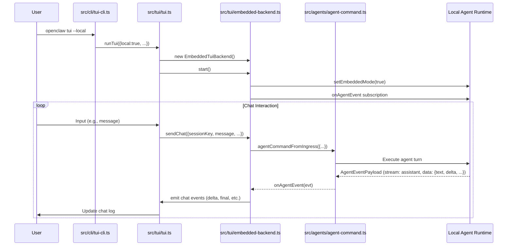

# OpenClaw TUI 嵌入模式 (TUI Embedded Mode)

> 最後更新：2026-04-25
> 完整性狀態：基於原始碼深度分析，涵蓋核心功能、架構原理與實際應用
> 相關原始碼：`src/cli/tui-cli.ts`、`src/tui/tui.ts`、`src/tui/embedded-backend.ts`、`src/tui/embedded-backend.test.ts`

## 概覽與設計動機

TUI 嵌入模式是 OpenClaw v2026.4.23 引入的革命性功能，允許使用者在終端機中直接運行 OpenClaw 聊天介面，**無需連接到遠端 Gateway**。此模式通過本地 agent 執行階段運行，同時保持 plugin approval 閘道的完整安全控制。

### 核心價值主張

1. **離線可用性**：無網路環境下的 OpenClaw 使用能力
2. **降低部署複雜度**：無需 Gateway 服務的簡化部署方案  
3. **資源隔離**：與主進程共享資源，但保持功能完整性
4. **安全維持**：所有 agent 指令仍需透過安全驗證，不繞過 plugin 閘道
5. **診斷優勢**：可直接在終端進行配置修復與問題排查

### 設計理念與演進目的

- **控制點分離**：CLI 負責參數解析，TUI 層負責後端選擇，後端負責執行階段細節
- **安全取捨**：即使在嵌入模式下，所有 agent 指令仍透過 `agentCommandFromIngress` 進行驗證
- **漸進式部署**：解決使用者在無網路或簡化部署情境下的需求
- **維持一致性**：嵌入模式與 Gateway 模式提供相同的 agent 能力與介面

## 架構與實作原理

### 核心模組

| 模組 | 檔案 | 作用 |
|------|------|------|
| CLI 入口 | `src/cli/tui-cli.ts` | 解析 `--local` 旗標與參數，驗證選項互斥性 |
| TUI 核心 | `src/tui/tui.ts` | 後端選擇邏輯、UI 管理與事件協調 |
| 嵌入式後端 | `src/tui/embedded-backend.ts` | 本地 agent 執行階段的直接溝通介面 |
| 嵌入式測試 | `src/tui/embedded-backend.test.ts` | 核心功能的單元測試與邊界驗證 |

### 關鍵型別定義

```typescript
// TUI 選項定義 (src/tui/tui-types.ts)
export interface TuiOptions {
  local: boolean;                          // 是否使用本地模式
  url?: string;                           // Gateway WebSocket URL（本地模式不使用）
  token?: string;                         // Gateway token（本地模式不使用）
  password?: string;                      // Gateway password（本地模式不使用）
  session?: string;                        // 會話鍵
  deliver?: boolean;                       // 是否傳送助手回覆
  thinking?: string;                       // 思考等級覆蓋
  message?: string;                       // 連接後發送的初始訊息
  timeoutMs?: number;                      // Agent 超時時間（毫秒）
  historyLimit?: number;                   // 歷史記錄載入限制
}

// 本地運行狀態 (src/tui/embedded-backend.ts)
type LocalRunState = {
  sessionKey: string;                     // 會話鍵
  controller: AbortController;            // 中止控制器
  buffer: string;                         // 助手回覆緩衝區
  isBtw: boolean;                         // 是否為 /btw side-result
  question?: string;                      /btw 問題內容
  finalSent: boolean;                     // 最終訊息是否已發送
  registered: boolean;                    // 是否已註冊到 TUI
};
```

### 核心流程



### 原始碼入口與驗證來源

| 類型 | 檔案 | 作用 |
|------|------|------|
| CLI 入口 | `src/cli/tui-cli.ts` | 解析 `--local` 旗標，驗證與遠端選項互斥 |
| TUI 核心 | `src/tui/tui.ts` | 後端選擇邏輯，嵌入式模式啟動流程 |
| 嵌入式後端 | `src/tui/embedded-backend.ts` | 本地 agent 執行，事件處理，狀態管理 |
| 嵌入式測試 | `src/tui/embedded-backend.test.ts` | 事件橋接，中止機制，embedded mode 旗標管理 |
| 官方文件 | `docs/cli/tui.md` | 基本用法說明與配置修復範例 |

## CLI 指令完整參考

### 命令樹

```text
openclaw tui
├─ --local              # 啟用嵌入式模式（與 --url/--token/--password 互斥）
├─ --url <url>         # Gateway WebSocket URL（本地模式不使用）
├─ --token <token>     # Gateway token（本地模式不使用）
├─ --password <password> # Gateway password（本地模式不使用）
├─ --session <key>     # 會話鍵（預設: "main" 或 workspace 推導值）
├─ --deliver           # 傳送助手回覆（預設: false）
├─ --thinking <level>   # 思考等級覆蓋
├─ --message <text>    # 連接後發送的初始訊息
├─ --timeout-ms <ms>   # Agent 超時時間（毫秒）
└─ --history-limit <n>  # 歷史記錄載入限制（預設: 200）
```

### 別名支援

```bash
openclaw chat      # 等同於 openclaw tui --local
openclaw terminal  # 等同於 openclaw tui --local
```

### 參數矩陣

| 參數 | 型別 | 必填 | 預設值 | 說明 |
|------|------|------|--------|------|
| `--local` | boolean | 否 | `false` | 啟用嵌入式模式，與遠端選項互斥 |
| `--url` | string | 否 | — | Gateway WebSocket URL（本地模式不使用） |
| `--token` | string | 否 | — | Gateway token（本地模式不使用） |
| `--password` | string | 否 | — | Gateway password（本地模式不使用） |
| `--session` | string | 否 | `"main"` 或 workspace 推導值 | 會話鍵，支持 `main`、`isolated`、`current`、`session:<id>` |
| `--deliver` | boolean | 否 | `false` | 是否傳送助手回覆到終端 |
| `--thinking` | string | 否 | — | 思考等級覆蓋：`off|minimal|low|medium|high|xhigh` |
| `--message` | string | 否 | — | 連接後自動發送的初始訊息 |
| `--timeout-ms` | number | 否 | — | Agent 超時時間（毫秒），預設來自 config |
| `--history-limit` | number | 否 | `200` | 歷史記錄載入限制 |

### 參數限制與互動規則

| 規則 | 說明 | 來源 |
|------|------|------|
| 本地模式互斥 | `--local` 不能與 `--url`、`--token`、`--password` 同時使用 | `src/cli/tui-cli.ts` |
| 會話自動推導 | 在 workspace 目錄中自動選擇對應 agent | `src/tui/tui.ts` |
| timeout 轉換 | `--timeout-ms` 透過 `parseTimeoutMs` 轉換為秒數 | `src/cli/tui-cli.ts` |
| 歷史限制 | 超過 1000 條記錄會自動限制為 1000 | `src/tui/embedded-backend.ts` |

### 測試覆蓋與未覆蓋空白

| 行為/規則 | 證據類型 | 來源 | 文件可下的結論 |
|-----------|----------|------|----------------|
| 事件橋接功能 | 測試 | `src/tui/embedded-backend.test.ts` | 已驗證：assistant/lifecycle 事件正確轉換為 chat 事件 |
| /btw side-result | 測試 | `src/tui/embedded-backend.test.ts` | 已驗證：side-result 事件正確處理與發送 |
| 中止機制 | 測試 | `src/tui/embedded-backend.test.ts` | 已驗證：AbortController 正確中止運行 |
| embedded mode 旗標 | 測試 | `src/tui/embedded-backend.test.ts` | 已驗證：setEmbeddedMode 正確設置與恢復 |
| 整合測試缺失 | 原始碼分析 | 無對應測試檔案 | 尚待補完：缺乏從 CLI 到嵌入模式的完整路徑整合測試 |
| Plugin approval 互動 | 原始碼推斷 | `src/tui/embedded-backend.ts` | 部分驗證：存在 approval gates 邏輯，但具體互動邊界待確認 |

### 實際指令範例

基本本地模式啟動：

```bash
# 使用別名啟動嵌入式 TUI
openclaw chat

# 使用明確的本地模式旗標
openclaw tui --local

# 在指定會話中啟動
openclaw tui --local --session isolated

# 啟動後自動發送初始訊息
openclaw tui --local --message "幫我分析這個專案的架構"
```

進階配置選項：

```bash
# 自訂歷史記錄限制
openclaw tui --local --history-limit 500

# 自訂超時時間
openclaw tui --local --timeout-ms 30000

# 啟用回傳模式
openclaw tui --local --deliver --session main

# 指定思考等級
openclaw tui --local --thinking high
```

## 進階使用場景

### 場景一：離線診斷與配置修復

**背景說明**：當 Gateway 不可用或需要進行本地配置診斷時，嵌入模式提供了直接在終端中修復配置的能力。

**完整步驟**：

```bash
# 1. 啟動嵌入式 TUI
openclaw chat

# 2. 在 TUI 中進行配置檢查
!openclaw config validate

# 3. 查看配置檔案位置
!openclaw config file

# 4. 檢查 Gateway 設定文件
!openclaw docs gateway auth token secretref

# 5. 進行配置修復
!openclaw config set agents.defaults.timeoutSeconds 60 --strict-json

# 6. 重新驗證配置
!openclaw config validate
```

**預期結果**：配置問題可以在不啟動 Gateway 的情況下直接修復，適用於網路不可用或 Gateway 服務異常的情況。

### 場景二：開發環境中的快速測試

**背景說明**：開發者需要在本地快速測試 agent 功能，而不需要完整的 Gateway 服務啟動。

**完整步驟**：

```bash
# 1. 在專案目錄中啟動（會自動選擇對應 agent）
cd /path/to/project
openclaw terminal

# 2. 測試本地工具功能
!ls -la
!cat package.json

# 3. 測試程式碼生成
請為這個專案創建一個 README.md 檔案

# 4. 測試檔案操作
!echo "# Test" > test.md
!cat test.md
```

**預期結果**：所有本地工具（檔案操作、系統指令等）正常工作，agent 能夠直接與開發環境互動。

### 場景三：安全隔離的 Agent 執行

**背景說明**：在某些安全敏感的環境中，需要確保 agent 執行完全隔離，不依賴外部網路服務。

**完整步驟**：

```bash
# 1. 啟用安全隔離的本地模式
openclaw tui --local --no-deliver --session isolated

# 2. 進行敏感操作測試
# （所有操作都在本地完成，無外部網路連接）

# 3. 使用 /btw 進行 side queries
/btw: 這個配置檔案有什麼安全風險？

# 4. 檢查執行狀態
/runs: 查看最近的執行記錄
```

**預期結果**：agent 在完全隔離的環境中執行，所有工具調用都經過安全驗證，不會意外連接到外部服務。

## 配置與客製化

### 常用設定路徑

| 路徑 | 型別 | 預設值 | 必填 | 作用 | 來源 |
|------|------|--------|------|------|------|
| `agents.defaults.timeoutSeconds` | number | 30 | 否 | Agent 執行超時時間 | `src/config/schema.help.ts` |
| `agents.defaults.thinkingDefault` | string | "medium" | 否 | 預設思考等級 | `src/agents/model-selection.js` |
| `agents.defaults.models` | map | — | 否 | 允許的模型列表 | `docs/gateway/configuration.md` |
| `session.mainKey` | string | "main" | 否 | 主要會話鍵 | `src/config/types.openclaw.ts` |
| `session.scope` | string | "per-sender" | 否 | 會話作用域 | `src/config/types.openclaw.ts` |

### 優先序與生效方式

1. **CLI 旗標**：最高優先級，直接覆蓋其他設定
2. **環境變數**：對於 SecretRef 提供者設定
3. **配置檔案**：`openclaw.json` 中的設定
4. **內建預設值**：系統預設值

### SecretRef / Provider / Env Var 寫法

嵌入模式支援與 Gateway 模式相同的 SecretRef 語法：

```bash
# 環境變數提供者
openclaw tui --local --token "$(openclaw config get channels.discord.token --ref-provider default --ref-source env --ref-id DISCORD_TOKEN)"

# 檔案提供者
openclaw tui --local --token "$(openclaw config get channels.telegram.token --ref-provider default --ref-source file --ref-id /path/to/token)"
```

### 變更生效方式

- **CLI 旗標**：立即生效，不需要重啟
- **配置檔案**：新會話生效，需要重新啟動 TUI
- **環境變數**：新會話生效，需要重新啟動 TUI

## 已知限制與注意事項

### 技術限制

1. **資源共享風險**：嵌入模式與主進程共享資源，如果 agent 執行階段崩潰，可能影響主進程
2. **Gateway-only 功能不可用**：某些依賴 Gateway 的功能（如多帳戶管理、遠端工具調用）在本地模式中不可用
3. **歷史記錄限制**：本地模式載入歷史記錄有硬性限制（1000 條），超過會自動截斷
4. **記憶體隔離**：不同會話之間的記憶狀態不完全隔離，可能存在記憶體洩漏風險

### 安全考慮

1. **Plugin approval gates**：即使在本地模式下，所有需要 approval 的工具仍會提示使用者確認
2. **執行權限**：本地模式擁有與執行進程相同的系統權限，需要謹慎使用
3. **敏感資訊**：本地執行可能暴露系統資訊，建議在安全的環境中使用

### 性能考量

1. **啟動時間**：嵌入模式啟動比 Gateway 模式快，因為不需要網路連接
2. **記憶體使用**：所有運行都在記憶體中，長時間使用可能需要監控記憶體使用量
3. **CPU 負載**：複雜的 agent 任務可能較高 CPU 使用率

## 常見問題排錯

| 症狀 | 可能原因 | 診斷指令 | 解法 |
|------|----------|----------|------|
| `--local` 與其他選項衝突 | 同時使用了 `--url`、`--token` 或 `--password` | 檢查命令列參數 | 移除遠端相關選項，只保留 `--local` |
| 配置驗證失敗 | 配置檔案存在錯誤 | `openclaw config validate` | 使用 `openclaw configure` 或 `openclaw doctor --fix` 修復配置 |
| 歷史記錄不完整 | 超過載入限制 | `openclaw tui --local --history-limit 500` | 增加歷史記錄限制或清除舊記錄 |
| Agent 執行失敗 | 超時或系統資源不足 | `openclaw tui --local --timeout-ms 60000` | 增加超時時間或檢查系統資源 |
| 工具 approval 失敗 | Plugin 需要使用者確認 | 在 TUI 中手動確認 | 確認工具使用授權 |
| 無法載入會話 | 會話檔案損壞或不存在 | `openclaw tui --local --session main` | 使用新的會話或修復會話檔案 |

## 參考資源

- [TUI 嵌入模式參考資料](references/tui-embedded-mode-ref.md) — 詳細的原始碼分析與測試證據
- [官方 TUI 文件](https://docs.openclaw.ai/cli/tui) — 基本用法與官方說明
- [CLI 參考](03-cli-reference.md) — 完整的 CLI 指令說明
- [配置文件](04-configuration.md) — 設定檔詳解與最佳實踐

---
*此文件由 AI agent 自動生成並持續更新*

## 更新記錄

- 2026-04-25：初始版本，基於 v2026.4.23 原始碼分析報告建立完整的 TUI 嵌入模式學習文件，涵蓋架構原理、CLI 參考、進階場景與故障排除