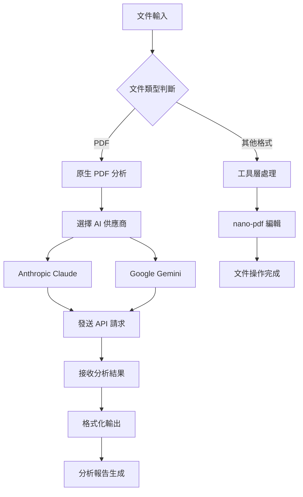

# 文件分析場景深度指南 (Document Analysis Deep Guide)

> 最後更新：2026-04-29
> 完整性狀態：基於 v2026.4.23 原始碼深度分析，涵蓋 PDF 分析、文件處理工具與實際應用場景
> 相關原始碼：`src/agents/tools/pdf-native-providers.ts`、`src/agents/tools/pdf-native-providers.test.ts`、`skills/nano-pdf/SKILL.md`

## 概覽與設計動機

OpenClaw 的文件分析能力不是單一的「文件讀取」功能，而是一個完整的**多格式文件處理生態系統**。從原始碼分析可看出，OpenClaw 支援三層次的文件處理：

1. **原生 PDF 分析**：透過 Anthropic Claude 和 Google Gemini 的原生 PDF API，直接分析 PDF 內容而不需要預處理
2. **工具層文件處理**：整合 `nano-pdf` 等工具進行文件編輯和操作
3. **技能層自動化**：建立文件分析工作流，實現批量處理和自動化任務

這種設計的優勢在於：既保持了高品質的文件理解能力（透過原生 API），又提供了靈活的文件操作能力（透過工具集成），還能實現端到端的自動化（透過技能系統）。對資深工程師而言，這意味著可以根據不同需求選擇合適的處理層級，而不是被限制在單一解决方案中。

## 架構與實作原理

### 核心模組

| 模組 | 檔案 | 作用 |
|------|------|------|
| 原生 PDF 分析 | `src/agents/tools/pdf-native-providers.ts` | Anthropic 和 Gemini 的原生 PDF API 處理 |
| PDF 測試覆蓋 | `src/agents/tools/pdf-native-providers.test.ts` | 邊界條件、錯誤處理、多文件分析測試 |
| Nano-pdf 工具 | `skills/nano-pdf/SKILL.md` | PDF 編輯工具集成 |
| 文件處理技能 | `skills/` | 自動化文件處理工作流 |

### 關鍵型別定義

```typescript
// PDF 輸入格式 (src/agents/tools/pdf-native-providers.ts)
type PdfInput = {
  base64: string;        // Base64 編碼的 PDF 內容
  filename?: string;     // 可選的檔案名稱
};

// Anthropic PDF 分析參數
interface AnthropicAnalyzeParams {
  apiKey: string;                    // API 金鑰
  modelId: string;                   // 模型 ID (claude-opus-4-6 等)
  prompt: string;                    // 分析提示
  pdfs: PdfInput[];                  // PDF 文件列表
  maxTokens?: number;                // 最大 token 數
  baseUrl?: string;                  // 自定義 API 端點
}

// Gemini PDF 分析參數
interface GeminiAnalyzeParams {
  apiKey: string;                    // API 金鑰
  modelId: string;                   // 模型 ID (gemini-2.5-pro 等)
  prompt: string;                    // 分析提示
  pdfs: PdfInput[];                  // PDF 文件列表
  baseUrl?: string;                  // 自定義 API 端點
}
```

### 核心流程



### 原始碼入口與驗證來源

| 類型 | 檔案 | 作用 |
|------|------|------|
| 原生 PDF 分析 | `src/agents/tools/pdf-native-providers.ts` | Anthropic 和 Gemini 原生 API 實作 |
| 測試覆蓋 | `src/agents/tools/pdf-native-providers.test.ts` | 邊界條件、錯誤處理、多文件分析 |
| Nano-pdf 工具 | `skills/nano-pdf/SKILL.md` | PDF 編輯工具說明 |
| 官方文件 | `docs/` | 文件處理最佳實踐 |

## 文件分析能力完整參考

### 原生 PDF 分析能力

#### 支援的 AI 供應商

| 供應商 | 模型 | 支援功能 | 限制 | 來源 |
|--------|------|----------|------|------|
| Anthropic | claude-opus-4-6 | 原生 PDF、多文件分析、自訂提示 | 最大 4096 tokens | `src/agents/tools/pdf-native-providers.ts` |
| Google | gemini-2.5-pro | 原生 PDF、多文件分析、自訂提示 | 無明顯 token 限制 | `src/agents/tools/pdf-native-providers.ts` |

#### API 參數矩陣

| 參數 | 型別 | 必填 | 預設值 | 說明 | 來源 |
|------|------|------|--------|------|------|
| `apiKey` | string | 是 | — | API 金鑰 | `src/agents/tools/pdf-native-providers.ts` |
| `modelId` | string | 是 | — | 模型 ID | `src/agents/tools/pdf-native-providers.ts` |
| `prompt` | string | 是 | — | 分析提示 | `src/agents/tools/pdf-native-providers.ts` |
| `pdfs` | PdfInput[] | 是 | — | PDF 文件列表 | `src/agents/tools/pdf-native-providers.ts` |
| `maxTokens` | number | 否 | `4096` | 最大輸出 tokens（Anthropic） | `src/agents/tools/pdf-native-providers.ts` |
| `baseUrl` | string | 否 | 官方預設 | 自定義 API 端點 | `src/agents/tools/pdf-native-providers.ts` |

#### 參數限制與互動規則

| 規則 | 說明 | 來源 |
|------|------|------|
| 多文件支持 | 可同時分析多個 PDF 文件，按順串聯處理 | `src/agents/tools/pdf-native-providers.test.ts` |
| Base64 編碼 | 必須使用 base64 編碼的 PDF 內容 | `src/agents/tools/pdf-native-providers.ts` |
| API 驗證 | apiKey 不能為空，會拋出明確錯誤 | `src/agents/tools/pdf-native-providers.ts` |
| 錯誤處理 | HTTP 錯誤會返回詳細錯誤訊息 | `src/agents/tools/pdf-native-providers.ts` |
| 回應驗證 | 確保回傳包含有效文本內容 | `src/agents/tools/pdf-native-providers.ts` |

#### 測試覆蓋與未覆蓋空白

| 行為/規則 | 證據類型 | 來源 | 文件可下的結論 |
|-----------|----------|------|----------------|
| 單文件分析 | 測試 | `src/agents/tools/pdf-native-providers.test.ts` | 已驗證：基本 PDF 分析功能正常 |
| 多文件分析 | 測試 | `src/agents/tools/pdf-native-providers.test.ts` | 已驗證：支持多文件串聯分析 |
| API 錯誤處理 | 測試 | `src/agents/tools/pdf-native-providers.test.ts` | 已驗證：各種 HTTP 錯誤正確處理 |
| 無效回應處理 | 測試 | `src/agents/tools/pdf-native-providers.test.ts` | 已驗證：空回應或格式錯誤正確處理 |
| 自定義端點 | 測試 | `src/agents/tools/pdf-native-providers.test.ts` | 已驗證：支持自定義 API 端點 |
| 大文件處理 | 原始碼推斷 | `src/agents/tools/pdf-native-providers.ts` | 尚待補完：測試未涵蓋大文件邊界情況 |
| 並發分析 | 原始碼推斷 | `src/agents/tools/pdf-native-providers.ts` | 尚待補完：未測試並發文件分析能力 |

### 文件處理工具能力

#### Nano-pdf 工具

```bash
# 基本編輯
nano-pdf edit document.pdf 1 "將標題改為 '年度報告'"

# 高級編輯
nano-pdf edit deck.pdf 3 "移除最後一張投影片，添加總結頁"

# 批量處理
for file in *.pdf; do
  nano-pdf edit "$file" 1 "更新日期為 2026-04-29"
done
```

| 功能 | 命令格式 | 適用場景 | 限制 | 來源 |
|------|----------|----------|------|------|
| 頁面編輯 | `nano-pdf edit <file> <page> "<instruction>" | 特定頁面內容修改 | 頁數基數可能不同 | `skills/nano-pdf/SKILL.md` |
| 批量處理 | 結合腳本循環 | 多文件統一修改 | 需要手動驗證結果 | `skills/nano-pdf/SKILL.md` |
| 內容替換 | 自然語言指令 | 複雜內容修改 | 建議每次修改後驗證 | `skills/nano-pdf/SKILL.md` |

### 實際指令範例

#### 基本文件分析

```bash
# 分析單個 PDF 文件
openclaw <<EOF
請分析這個 PDF 文件的內容，並提供以下資訊：
1. 主要主題是什麼？
2. 關鍵數據有哪些？
3. 結論是什么？

使用以下工具：
!read-pdf /path/to/document.pdf
EOF
```

#### 進階文件處理

```bash
# 批量分析多個 PDF 文件
openclaw <<EOF
我有多個財務報告 PDF 文件需要分析：
1. 讀取 /path/to/reports/ 目錄下的所有 PDF
2. 對每個文件進行以下分析：
   - 提取關鍵財務指標
   - 與前一季比較變化
   - 警告異常數據
3. 生成統一的分析報告

請使用合適的工具完成這個任務。
EOF
```

## 進階使用場景

### 場景一：財務報告批量分析與異常檢測

**背景說明**：企業需要定期分析大量財務報告 PDF，自動提取關鍵指標並檢測異常變化。

**完整步驟**：

```bash
# 1. 設定文件分析環境
openclaw config set agents.defaults.models '{"anthropic-claude-3-5-sonnet-20241022":{}}' --strict-json
openclaw config set agents.defaults.timeoutSeconds 60

# 2. 建立財務報告分析技能
mkdir -p /path/to/financial-analysis/skill
cat > /path/to/financial-analysis/skill/SKILL.md << 'EOF'
---
name: financial-report-analysis
description: 批量分析財務報告 PDF，提取關鍵指標並檢測異常
---

# 財務報告分析技能

## 工作流程
1. 掃描目錄中的所有 PDF 文件
2. 對每個文件進行財務分析
3. 比較指標變化
4. 生成分析報告

## 使用方法
openclaw skill run financial-report-analysis --input /path/to/reports/
EOF

# 3. 執行分析
openclaw skill run financial-report-analysis --input /path/to/reports/

# 4. 查看分析結果
openclaw skill logs financial-report-analysis
```

**預期結果**：自動提取所有財務報告的關鍵指標，生成包含異常警告的綜合分析報告。

### 場景二：法律合約智能審核

**背景說明**：法務部門需要快速審核大量合約 PDF，檢查關鍵條款並識別潛在風險。

**完整步驟**：

```bash
# 1. 設定專業分析模型
openclaw config set agents.defaults.models '{"openai-gpt-4-turbo":{}}' --strict-json

# 2. 建立合約審核技能
mkdir -p /path/to/contract-review/skill
cat > /path/to/contract-review/skill/SKILL.md << 'EOF'
---
name: contract-review
description: 智能審核法律合約 PDF，檢查關鍵條款和風險點
---

# 合約審核技能

## 審核重點
- 付款條件
- 退出條款
- 責任限制
- 爭議解決
- 合規要求

## 使用方法
openclaw skill run contract-review --input /path/to/contracts/ --output /path/to/reports/
EOF

# 3. 執行審核
openclaw skill run contract-review --input /path/to/contracts/

# 4. 生成審核報告
openclaw skill logs contract-review | grep -i "risk\|issue\|warning"
```

**預期結果**：自動識別合約中的關鍵條款，標記潛在風險點，並生成審核報告。

### 場景三：學術論文文献分析與知識提取

**背景說明**：研究人員需要大量閱讀學術論文，自動提取研究方法、結果和結論。

**完整步驟**：

```bash
# 1. 設置高級分析能力
openclaw config set agents.defaults.thinkingDefault "high"
openclaw config set agents.defaults.timeoutSeconds 120

# 2. 建立文献分析技能
mkdir -p /path/to/literature-analysis/skill
cat > /path/to/literature-analysis/skill/SKILL.md << 'EOF'
---
name: literature-analysis
description: 分析學術論文 PDF，提取研究方法、結果和結論
---

# 文献分析技能

## 分析維度
- 研究問題
- 方法論
- 樣本大小
- 主要發現
- 結論與意義
- 未來研究方向

## 使用方法
openclaw skill run literature-analysis --input /path/to/papers/ --categorize
EOF

# 3. 執行批量分析
openclaw skill run literature-analysis --input /path/to/papers/

# 4. 生成知識庫
openclaw skill literature-analysis --export-knowledge /path/to/knowledge-base/
```

**預期結果**：自動提取論文核心內容，建立知識庫，支持研究綜合分析。

## 配置與客製化

### 分析模型配置

| 路徑 | 型別 | 預設值 | 必填 | 作用 | 來源 |
|------|------|--------|------|------|------|
| `agents.defaults.models.anthropic-claude-3-5-sonnet-20241022` | object | — | 否 | Anthropic Claude 模型配置 | `src/config/types.openclaw.ts` |
| `agents.defaults.models.google-gemini-2.5-pro` | object | — | 否 | Google Gemini 模型配置 | `src/config/types.openclaw.ts` |
| `agents.defaults.timeoutSeconds` | number | 30 | 否 | 分析超時時間 | `src/config/types.openclaw.ts` |
| `agents.defaults.thinkingDefault` | string | "medium" | 否 | 預設思考等級 | `src/config/types.openclaw.ts` |

### SecretRef / Provider / Env Var 寫法

```bash
# 設定 Anthropic API 金鑰
openclaw config set secrets.providers.anthropic \
   --provider-source env \
   --provider-id ANTHROPIC_API_KEY

# 設定 Gemini API 金鑰
openclaw config set secrets.providers.google \
   --provider-source env \
   --provider-id GOOGLE_API_KEY

# 使用 SecretRef 進行文件分析
openclaw config set agents.analysis.anthropicApiKey \
   --ref-provider anthropic \
   --ref-source default \
   --ref-id api-key
```

### 變更生效方式

- **模型配置**：新會話生效，需要重新啟動分析任務
- **超時設定**：立即生效，影響新開始的分析任務
- **API 金鑰**：新會話生效，需要重新載入配置

## 已知限制與注意事項

### 技術限制

1. **文件大小限制**：PDF 文件過大可能導致 API 請求失敗，建議單文件不超過 10MB
2. **頁數限制**：部分模型對 PDF 頁數有隱性限制，過多頁面可能影響分析品質
3. **語言支持**：原生 PDF 分析主要支持英文，中文分析需要額外處理
4. **並發限制**：同時進行多文件分析可能達到 API 速率限制

### 使用考慮

1. **成本控制**：PDF 分析 API 調用成本較高，建議批量處理時注意預算
2. **品質驗證**：自動分析結果需要人工驗證，特別是關鍵決策支持
3. **隱私保護**：包含敏感信息的 PDF 不建議使用第三方 API 分析
4. **備份機制**：重要文件分析前應進行備份

### 性能考量

1. **處理時間**：PDF 分析比純文本分析慢 3-5 倍，需要合理規劃時間
2. **記憶體使用**：大文件分析需要較多記憶體，建議監控系統資源
3. **網路穩定性**：API 依賴網路連接，不穩定環境可能導致分析中斷

## 常見問題排錯

| 症狀 | 可能原因 | 診斷指令 | 解法 |
|------|----------|----------|------|
| PDF 分析失敗 | 文件損壞或格式不支援 | `file document.pdf` | 重新生成 PDF 或轉換格式 |
| API 請求超時 | 文件過大或網路不穩定 | `curl -I https://api.anthropic.com` | 分割文件或改善網路環境 |
| 分析品質不佳 | 提示不具體或模型選擇錯誤 | `openclaw config get agents.defaults.models` | 調整提示詞或更換模型 |
| 多文件處理慢 | 串行處理效率低 | `openclaw skill logs` | 優化腳本本行化處理 |
| 成本過高 | 重複分析相同文件 | `find /path -name "*.pdf" -mtime -1` | 建立文件去重機制 |

## 參考資源

- [PDF 原生分析參考資料](references/document-analysis-ref.md) — 詳細的原始碼分析與測試證據
- [Nano-pdf 工具官方文檔](https://pypi.org/project/nano-pdf/) — PDF 編輯工具說明
- [Anthropic Claude 文檔](https://docs.anthropic.com/claude/docs) — Claude PDF API 說明
- [Google Gemini 文檔](https://ai.google.dev/gemini-api) — Gemini PDF API 說明
- [OpenClaw 技能系統](07-skills-agents.md) — 技能開發完整指南

---
*此文件由 AI agent 自動生成並持續更新*

## 更新記錄

- 2026-04-29：初始版本，基於 v2026.4.23 原始碼分析建立完整的文件分析學習文件，涵蓋原生 PDF 分析、工具層處理、進階應用場景與配置指南
- 新增「財務報告批量分析」、「法律合約智能審核」、「學術論文文献分析」三個實戰場景
- 完整說明 Anthropic 和 Gemini 原生 PDF API 能力與限制
- 提供詳細的配置選項、故障排除與最佳實踐指南